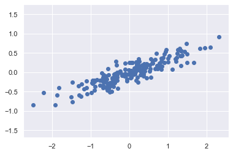
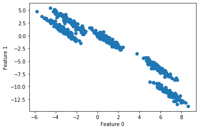
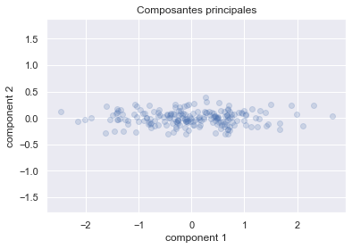
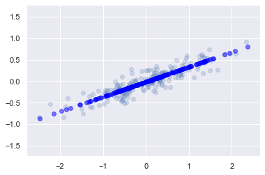
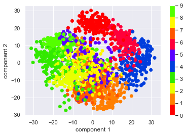
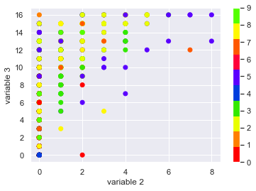
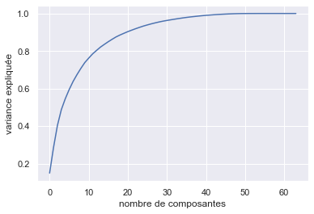
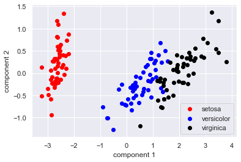
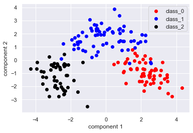

Title: ACP bébé
Date: 2021-02-01 11:15
Category: Data Science 
Tags: python, scikit-learn, clustering
Slug: acp
Authors: Antoine Sireyjol
Summary: Rien à voir, c'est juste un test

[TOC]

[[embed url=http://www.youtube.com/watch?v=6YbBmqUnoQM]]

# Analyse en composantes principales

Ce notebook reprend une partie des exemples du chapitre du Python Data Science Handbook sur l'analyse en composantes principales écrit par Jake VanderPlas et disponible ici : https://jakevdp.github.io/PythonDataScienceHandbook/05.09-principal-component-analysis.html

## Explication introductive

L'analyse en composantes principales est une méthode consistant à transformer des variables corrélées entre elles en nouvelles variables. Chacune de ces nouvelles variables est le résultat d'une combinaison linéaire des anciennes variables. Ces nouvelles variables sont appelées composantes principales et sont décorrélées les unes des autres. Leur nombre est inférieur ou égal au nombre de variables à l'origine. Cette méthode est donc utilisée en particulier pour réduire le nombre de dimensions (= de variables) d'une problématique donnée. 

On commence par importer les modules nécessaires : 


```python
%matplotlib inline
import numpy as np
import matplotlib.pyplot as plt
import seaborn as sns; sns.set()
from sklearn.preprocessing import StandardScaler
```

## Premier exemple en deux dimensions

On reprend les variables créées par Jake VanderPlas pour son exemple en 2 dimensions : 


```python
rng = np.random.RandomState(1)
X = np.dot(rng.rand(2, 2), rng.randn(2, 200)).T
plt.scatter(X[:, 0], X[:, 1])
plt.axis('equal');
```





Les variables X et Y sont clairement liées par une relation linéaire, mais ça n'est pas ce qui nous intéresse forcément en ACP. On va chercher à représenter comment les points sont distribués en fonction des valeurs de x et y.

Commençons par construire les 2 premières composantes des valeurs de X :


```python
from sklearn.decomposition import PCA
pca = PCA(n_components = 2)
pca.fit(X)
```


    PCA(copy=True, iterated_power='auto', n_components=2, random_state=None,
        svd_solver='auto', tol=0.0, whiten=False)


L'objet pca une fois adapté ("fité") aux données contient deux objets qui nous intéressent particulièrement :  
- les composantes  
- la variance expliquée

On peut retrouver ces éléments ainsi : 


```python
pca.components_
```


    array([[-0.94446029, -0.32862557],
           [-0.32862557,  0.94446029]])


On interprète ces composantes ainsi :   
PC1 = -0.94 * x1 - 0.32 * x2  
PC2 = -0.32 * x1 + 0.94 * x2

Pour la variance, on peut sortir la variance expliquée par les composantes principales et la part de la variance totale expliquée par ces composantes : 


```python
pca.explained_variance_
```


    array([0.7625315, 0.0184779])


```python
np.var(X[:, 0]) + np.var(X[:, 1])
```


    0.7771043494141933


```python
pca.explained_variance_ratio_
```


    array([0.97634101, 0.02365899])


Ce ratio représente la contribution de chaque composante à l'explication de la variance globale. On remarque ici qu'une seule composante principale permet d'expliquer 97% de la variance globale. Comme on a utilisé autant de composantes principales que de variables disponibles, le ratio somme à 1.  

Les composantes principales peuvent être représentées comme des nouveaux axes, que Jake VanderPlas représnete ainsi dans son article, la longueur des vecteurs étant associée à l'importance de la variance expliquée par chacune des composantes :  


```python
def draw_vector(v0, v1, ax=None):
    ax = ax or plt.gca()
    arrowprops=dict(arrowstyle='->',
                    linewidth=2,
                    color = "black",
                    shrinkA=0, shrinkB=0)
    ax.annotate('', v1, v0, arrowprops=arrowprops)

# plot data
plt.scatter(X[:, 0], X[:, 1], alpha=0.2)
for length, vector in zip(pca.explained_variance_, pca.components_):
    v = vector * 3 * np.sqrt(length)
    draw_vector(pca.mean_, pca.mean_ + v)
plt.axis('equal');
```





Le premier axe est défini en fonction de la direction de la plus grande variance, le second axe (qui doit être orthogonal au premier) en fonction de la direction de la seconde plus grande variance (et caetera quand il y a plus de dimensions).  
On peut également représenter graphiquement les points dans un nouveaux système de coordonnées où les axes sont les composantes principales. Comme les composantes principales sont définies de manière à ne pas être corrélées entre elles, la représentation graphique ne laisse pas apparaître de liens de corrélation entre celles-ci : 


```python
X_pca = pca.transform(X)
plt.scatter(X_pca[:, 0], X_pca[:, 1], alpha=0.2)
plt.axis('equal')
plt.xlabel('component 1')
plt.ylabel('component 2')
plt.title('Composantes principales')
```


    Text(0.5, 1.0, 'Composantes principales')





On profite d'avoir créé `X_pca` pour vérifier que les axes sont bien décorrélés : 


```python
np.corrcoef(X_pca[:, 0], X_pca[:, 1])
```


    array([[ 1.00000000e+00, -5.12304892e-16],
           [-5.12304892e-16,  1.00000000e+00]])


```python
X_pca[0]
```


    array([0.67676923, 0.0597386 ])


## Réduction du nombre de dimensions

L'ACP est surtout intéressante pour réduire le nombre de dimensions lors d'une analyse tout en conservant le plus de variance expliquée de nos observations. On peut le faire par exemple dans notre cas en ne retenant qu'une seule composante principale : 


```python
pca = PCA(n_components=1)
pca.fit(X)
X_pca = pca.transform(X)
print("original shape:   ", X.shape)
print("transformed shape:", X_pca.shape)
```

    original shape:    (200, 2)
    transformed shape: (200, 1)


Ce qui donne en représentation graphique : 


```python
X_new = pca.inverse_transform(X_pca)
plt.scatter(X[:, 0], X[:, 1], alpha=0.2)
plt.scatter(X_new[:, 0], X_new[:, 1], alpha=0.5, color = "blue")
plt.axis('equal');
```





## Cas pratique sur  les chiffres écrits à la main

Vous pouvez charger les données ainsi : 


```python
from sklearn.datasets import load_digits
digits = load_digits()
digits.data
```


    array([[ 0.,  0.,  5., ...,  0.,  0.,  0.],
           [ 0.,  0.,  0., ..., 10.,  0.,  0.],
           [ 0.,  0.,  0., ..., 16.,  9.,  0.],
           ...,
           [ 0.,  0.,  1., ...,  6.,  0.,  0.],
           [ 0.,  0.,  2., ..., 12.,  0.,  0.],
           [ 0.,  0., 10., ..., 12.,  1.,  0.]])


```python
digits.data.shape
```


    (1797, 64)


__À vous__ :  
- Faites une analyse en composantes principales avec 2 composantes principales  
- Donnez la part de variance expliquée par ces deux composantes  
- Représentez les données en fonction de ces composantes principales. Cette analyse permet-elle de séparer correctement les différentes classes? (Rappel : les numéros corrects sont donnés par digits.target)            
-   
- 
-   
-   
-   
-   
- 
-   
-   
- 
-    
-    

__On corrige ensemble__


```python
pca = PCA(n_components = 2)  # project from 64 to 2 dimensions
projected = pca.fit_transform(digits.data) # pca.fit_transform = pca.fit() + pca.transform()
```

Les ratios de variance expliquée sont les suivants : 


```python
pca.explained_variance_ratio_
```


    array([0.14890594, 0.13618771])


```python
pca.explained_variance_ratio_.sum()
```


    0.28509364823699085


Soit moins de 30% de la variance totale expliquée avec les deux premières composantes... 

Les composantes sont les suivantes (juste les 6 premières colonnes) : 


```python
pca.components_[:, range(6)]
```


    array([[ 6.78177507e-18, -1.73094639e-02, -2.23428828e-01,
            -1.35913306e-01, -3.30323109e-02, -9.66340806e-02],
           [-1.56589325e-17, -1.01064568e-02, -4.90849204e-02,
            -9.43338268e-03, -5.36015799e-02, -1.17755315e-01]])


```python
plt.scatter(projected[:, 0], projected[:, 1],
            c=digits.target, cmap=plt.cm.get_cmap('prism', 10))
plt.xlabel('component 1')
plt.ylabel('component 2')
plt.colorbar()
```


    <matplotlib.colorbar.Colorbar at 0x142c6705518>





```python
# Qu'est-ce qu'on a si on fait la même représentation sur 
# 2 variables au hasard?
plt.scatter(digits.data[:, 1], digits.data[:, 2],
            c=digits.target, cmap=plt.cm.get_cmap('prism', 10))
plt.xlabel('variable 2')
plt.ylabel('variable 3')
plt.colorbar()
```


    <matplotlib.colorbar.Colorbar at 0x142c6614a90>





On voit que l'ACP permet en partie de séparer les différentes classes mais probablement pas assez pour permettre une bonne classification dans ce repère de données.  Dans son article, Jake VanderPlas montre qu'avec une ACP de 8 composantes principales on peut reconstruire les représentations des chiffres quasiment à l'identique (donc avec 8 fois moins de variables!). C'est donc une solution possible pour accélérer considérablement le temps d'exécution d'algorithmes de machine learning.

## Choisir le nombre de composantes 

Si choisir deux composantes principales est toujours intéressant pour pouvoir représenter graphiquement ses résultats, il est important de tenir compte de la variance expliquée par chaque composante afin de déterminer quel nombre retenir.  

On peut pour cela représenter l'évolution du ratio de la variance expliquée en fonction du nombre de composantes retenues :  


```python
pca = PCA(64).fit(digits.data)
plt.plot(np.cumsum(pca.explained_variance_ratio_))
plt.xlabel('nombre de composantes')
plt.ylabel('variance expliquée')
plt.show()
```





On peut avec la fonction `PCA` définir le nombre de composantes voulues mais aussi la variance minimum à atteindre : 


```python
pca = PCA(0.75).fit(digits.data)
pca.n_components_
```


    11


```python
pca = PCA(11).fit(digits.data)
pca.explained_variance_ratio_.sum()
```


    0.7619490686562893


## Cas pratique 1 : ACP sur iris
- Importez la base de données iris disponible dans sklearn.datasets
- Avant de mener notre ACP, il faudrait transformer d'abord nos données. Voyez-vous de quelle manière?
- Faites une ACP avec deux composantes et représentez les points en fonction de ces composantes.  
- Les différentes espèces de fleurs sont-elles bien partitionnées dans ce plan?  


```python
# Import données
from sklearn.datasets import load_iris

values, target = load_iris(return_X_y=True)
target_names = load_iris().target_names

# On paramètre notre PCA
pca=PCA(2)
pca_iris = pca.fit_transform(values)
```


```python
pca.explained_variance_ratio_.sum()
```


    0.9776852063187949


```python
# On fait le plot

color = ["red", "blue", "black"]
for i in range(3):
    plt.scatter(pca_iris[target == i, 0], pca_iris[target == i, 1],
            c=color[i], label = target_names[i])
plt.xlabel('component 1')
plt.ylabel('component 2')
plt.legend()
plt.show()
```





## Cas pratique 2 : classification des vins  
- Importez la base de données wine disponible dans sklearn.datasets   
- Faites le graphique de l'évolution du ratio de la variance expliquée en fonction du nombre de composantes principales. Y-a-t-il matière à réduire le nombre de dimensions? Quel nombre de composantes principales choisiriez-vous?  
- Faites une ACP et représentez les points en fonction de ces composantes.  
- Les différentes classes sont-elles bien partitionnées dans ce plan?  


```python
# Import données
from sklearn.datasets import load_wine

values, target = load_wine(return_X_y=True)
target_names = load_wine().target_names

# on standardise nos données : 
from sklearn.preprocessing import StandardScaler
values_cr = StandardScaler().fit_transform(values)

# On paramètre notre PCA pour qu'il y ait 80% de la variance expliquée
pca=PCA(0.80)
pca_wine = pca.fit_transform(values_cr)
```


    ---------------------------------------------------------------------------

    NameError                                 Traceback (most recent call last)

    <ipython-input-1-a2c2529e71c4> in <module>()
         10 
         11 # On paramètre notre PCA pour qu'il y ait 80% de la variance expliquée
    ---> 12 pca=PCA(0.80)
         13 pca_wine = pca.fit_transform(values_cr)


    NameError: name 'PCA' is not defined


```python
pca.n_components_
```


    5


```python
pca.explained_variance_ratio_.sum()
```


    0.8016229275554788


```python
values.shape[1]
```


    13


On explique 80% de la variance avec 5 composantes principales, et il y a 13 variables dans le datasets initial.

Voyons comment les deux premières composantes nous permettent de représenter les données : 


```python
color = ["red", "blue", "black"]
for i in range(3):
    plt.scatter(pca_wine[target == i, 0], pca_wine[target == i, 1],
            c=color[i], label = target_names[i])
plt.xlabel('component 1')
plt.ylabel('component 2')
plt.legend()
plt.show()
```





## Cas pratique 3 : modèle de prédiction sur MNIST  
- Sur les données MNIST, choisissez le nombre de composantes principales permettant de garder 75% de la variance totale.  
- Faites tourner un modèle de prédiction de régression logistique comme celui que vous aviez fait avec Louis.  
- Comparez les résultats en termes de précision.  
- Comparez les résultats en termes de temps d'exécution


```python
from sklearn.datasets import load_wine
features, target = load_wine(return_X_y=True)

target
```


    array([0, 0, 0, 0, 0, 0, 0, 0, 0, 0, 0, 0, 0, 0, 0, 0, 0, 0, 0, 0, 0, 0,
           0, 0, 0, 0, 0, 0, 0, 0, 0, 0, 0, 0, 0, 0, 0, 0, 0, 0, 0, 0, 0, 0,
           0, 0, 0, 0, 0, 0, 0, 0, 0, 0, 0, 0, 0, 0, 0, 1, 1, 1, 1, 1, 1, 1,
           1, 1, 1, 1, 1, 1, 1, 1, 1, 1, 1, 1, 1, 1, 1, 1, 1, 1, 1, 1, 1, 1,
           1, 1, 1, 1, 1, 1, 1, 1, 1, 1, 1, 1, 1, 1, 1, 1, 1, 1, 1, 1, 1, 1,
           1, 1, 1, 1, 1, 1, 1, 1, 1, 1, 1, 1, 1, 1, 1, 1, 1, 1, 1, 1, 2, 2,
           2, 2, 2, 2, 2, 2, 2, 2, 2, 2, 2, 2, 2, 2, 2, 2, 2, 2, 2, 2, 2, 2,
           2, 2, 2, 2, 2, 2, 2, 2, 2, 2, 2, 2, 2, 2, 2, 2, 2, 2, 2, 2, 2, 2,
           2, 2])


```python
from sklearn.datasets import load_iris
features, target = load_iris(return_X_y=True)

target
```


    array([0, 0, 0, 0, 0, 0, 0, 0, 0, 0, 0, 0, 0, 0, 0, 0, 0, 0, 0, 0, 0, 0,
           0, 0, 0, 0, 0, 0, 0, 0, 0, 0, 0, 0, 0, 0, 0, 0, 0, 0, 0, 0, 0, 0,
           0, 0, 0, 0, 0, 0, 1, 1, 1, 1, 1, 1, 1, 1, 1, 1, 1, 1, 1, 1, 1, 1,
           1, 1, 1, 1, 1, 1, 1, 1, 1, 1, 1, 1, 1, 1, 1, 1, 1, 1, 1, 1, 1, 1,
           1, 1, 1, 1, 1, 1, 1, 1, 1, 1, 1, 1, 2, 2, 2, 2, 2, 2, 2, 2, 2, 2,
           2, 2, 2, 2, 2, 2, 2, 2, 2, 2, 2, 2, 2, 2, 2, 2, 2, 2, 2, 2, 2, 2,
           2, 2, 2, 2, 2, 2, 2, 2, 2, 2, 2, 2, 2, 2, 2, 2, 2, 2])


