Title: Les séries temporelles avec Python (2/4) - Visualisations et opérations sur les séries temporelles
Author: Louis
Date: '2021-05-27'
Slug: timeseries-2
Category: Python, Séries Temporelles
Tags: Python, Machine Learning, Statistiques, Data Science, Séries temporelles, Datetime
Cover: images/cover_4.png
Summary: Quelques opérations sur les séries temporelles, illustré par une petite étude de cas à bicyclette.

[TOC]

Cet article est le second de notre série sur les données temporelles :  

1. Introduction à la manipulation de données temporelles avec Python
2. **Visualisations et opérations sur les séries temporelles**
3. Éléments théoriques et exemples
4. Analyse, modélisation et prédiction

Il s'intéresse dans un premier temps à la visualisation et aux opérations que l'on peut effectuer sur ces objets avant de conclure sur un petit exemple en utilisant les outils présentés dans ces 2 premiers posts.  

# Un peu d'anglicisme : Resampling, Shifting, and Windowing

- *Resampling* = rééchantillonnage
- *Shifting* = déplacement
- *Windowing* = fenêtrage

La capacité à utiliser les dates/times comme indices pour organiser et accéder aux données est le fondement des outils de séries temporelles sur Pandas. Les avantages de l'indexation (alignement, slicing, etc...) sont conservés et Pandas fournit par ailleurs plusieurs opérations spécifiques aux séries temporelles.

On va donc développer ici quelques unes de ces opérations merveilleuses en utilisant comme premier exemple le cours de l'action Google en bourse (données récupérées sur <a href="https://fr.finance.yahoo.com/quote/GOOG/history?p=GOOG" target="_blank">Yahoo finance</a>).

Petite précision en passant, le terme "séries temporelles" désigne en général, dans le contexte `Pandas`, un objet `Series` indexé par un `DatetimeIndex`.

```python
import pandas as pd
# parse_dates=True permet à pandas de repérer les dates sous différents formats
goog = pd.read_csv('data/GOOG.csv', index_col='Date', parse_dates=True)
goog.head(2)
```


<div>
<style scoped>
    .dataframe tbody tr th:only-of-type {
        vertical-align: middle;
    }

    .dataframe tbody tr th {
        vertical-align: top;
    }

    .dataframe thead th {
        text-align: right;
    }
</style>
<table border="1" class="dataframe">
  <thead>
    <tr style="text-align: right;">
      <th></th>
      <th>Open</th>
      <th>High</th>
      <th>Low</th>
      <th>Close</th>
      <th>Adj Close</th>
      <th>Volume</th>
    </tr>
    <tr>
      <th>Date</th>
      <th></th>
      <th></th>
      <th></th>
      <th></th>
      <th></th>
      <th></th>
    </tr>
  </thead>
  <tbody>
    <tr>
      <th>2004-08-19</th>
      <td>49.813290</td>
      <td>51.835709</td>
      <td>47.800831</td>
      <td>49.982655</td>
      <td>49.982655</td>
      <td>44871361</td>
    </tr>
    <tr>
      <th>2004-08-20</th>
      <td>50.316402</td>
      <td>54.336334</td>
      <td>50.062355</td>
      <td>53.952770</td>
      <td>53.952770</td>
      <td>22942874</td>
    </tr>
  </tbody>
</table>
</div>


```python
goog.tail(2)
```


<div>
<style scoped>
    .dataframe tbody tr th:only-of-type {
        vertical-align: middle;
    }

    .dataframe tbody tr th {
        vertical-align: top;
    }

    .dataframe thead th {
        text-align: right;
    }
</style>
<table border="1" class="dataframe">
  <thead>
    <tr style="text-align: right;">
      <th></th>
      <th>Open</th>
      <th>High</th>
      <th>Low</th>
      <th>Close</th>
      <th>Adj Close</th>
      <th>Volume</th>
    </tr>
    <tr>
      <th>Date</th>
      <th></th>
      <th></th>
      <th></th>
      <th></th>
      <th></th>
      <th></th>
    </tr>
  </thead>
  <tbody>
    <tr>
      <th>2021-05-21</th>
      <td>2365.98999</td>
      <td>2369.00000</td>
      <td>2342.370117</td>
      <td>2345.100098</td>
      <td>2345.100098</td>
      <td>1139600</td>
    </tr>
    <tr>
      <th>2021-05-24</th>
      <td>2367.00000</td>
      <td>2418.47998</td>
      <td>2360.110107</td>
      <td>2406.669922</td>
      <td>2406.669922</td>
      <td>1061400</td>
    </tr>
  </tbody>
</table>
</div>


Ces données recensent certaines informations sur l'action Google du 19 août 2004 au 24 mai 2021 : les prix à l'ouverture et à la clôture, le maximum et le minimum sur la journée, les prix ajustés et les volumes. On étudie ici la série temporelle des prix à la clôture.


```python
goog = goog['Close']
goog.index
```


    DatetimeIndex(['2004-08-19', '2004-08-20', '2004-08-23', '2004-08-24',
                   '2004-08-25', '2004-08-26', '2004-08-27', '2004-08-30',
                   '2004-08-31', '2004-09-01',
                   ...
                   '2021-05-11', '2021-05-12', '2021-05-13', '2021-05-14',
                   '2021-05-17', '2021-05-18', '2021-05-19', '2021-05-20',
                   '2021-05-21', '2021-05-24'],
                  dtype='datetime64[ns]', name='Date', length=4220, freq=None)


C'est bien une série indexée par un `DatetimeIndex` que l'on affiche avec style en fixant les paramètres d'affichage par défaut comme étant ceux de `seaborn` : 


```python
import matplotlib.pyplot as plt
import seaborn as sns ; sns.set() #pour définir les paramètres d'affichage de seaborn par défaut
plt.rcParams["figure.figsize"] = (12,8)
```


```python
goog.plot();
```


    
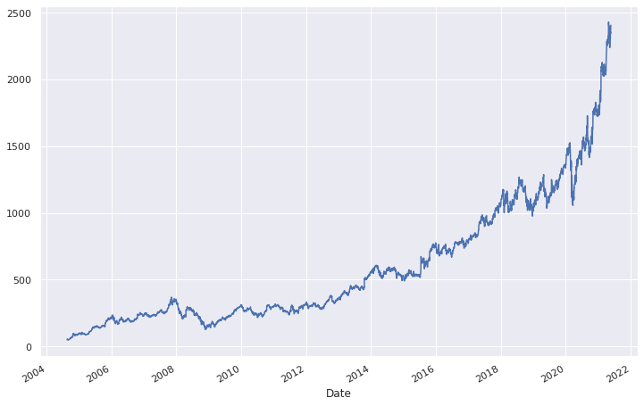
    


## Rééchantillonage et conversion de fréquences

Une manipulation classique des séries temporelles est le rééchantionnage (resampling) à une fréquence plus ou moins haute. Cela consiste à augmenter ou diminuer la fréquence des observations. Il y a donc 2 possibilités :  
- si on augmente la fréquence cela veut dire ajouter des points et dans ce cas il faut définir quelle stratégie utiliser pour interpoler les nouveaux points (un exemple de stratégie basique est de répéter la dernière valeur) ;  
- si on diminue la fréquence, ce qui est le cas le plus classique, on va supprimer des points et il faut là aussi déterminer la stratégie à utiliser. Deux options sont possibles : on sélectionne uniquement les points correspondants à la nouvelle fréquence plus faible ou bien on agrège les points entre 2 fréquences en utilisant une fonction d'aggrégation comme par exemple une moyenne, une médiane, un max, etc...

Pour ce faire, `pandas` dispose de deux méthodes qui sont `resample()` ou `asfreq()`. La différence entre les deux est que `resample` consiste à agréger toutes les données comprises entre 2 multiples de la fréquence alors que `asfreq` sélectionne la valeur correspondant à la fréquence. Aussi, `resample` renvoie un objet particulier qui est un `DatetimeIndexResampler` sur lequel il faut appliquer une méthode d'aggrégation ou d'imputation pour récupérer une série. La méthode `asfreq` retourne directement une série.

On va de ce pas illustrer avec la série Google en diminuant la fréquence afin de n'avoir qu'un point par année. On va prendre le dernier jour ouvrable de l'année (jour ouvrable car la série prend des valeurs uniquement pour les jours ouvrables).

Petit rappel, on utilise ci-dessous, le code de fréquence `BA` pour récupérer le dernier jour ouvrable de l'année mais pour en savoir plus sur les fréquences, <a href="https://blog.statoscop.fr/timeseries-1.html" target="_blank">l'épisode 1 de cette série</a> vous en apprendra davantage.


```python
goog.plot(alpha=0.4)
goog.resample('BA').mean().plot()
goog.asfreq('BA').plot();
plt.legend(['close', 'resample', 'asfreq'], loc='upper left');
```


    
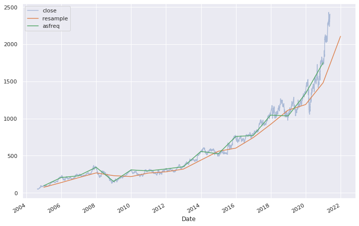
    


Pour un resampling avec une fréquence plus importante, `resample()` et `asfreq()` sont équivalentes. Par défaut, les 2 méthodes laissent les valeurs non existantes vides. Toutefois, `asfreq()` accepte un paramètre `method` dans lequel on peut spécifier comment imputer les valeurs manquantes générées par l'augmentation de la fréquence. C'est faisable aussi avec `resample` en utilisant les méthodes `bfill` ou `ffill` des objets `pandas.core.resample.Resampler`.

Le petit bout de code ci-dessous selectionne uniquement les 14 derniers jours et effectue un resampling de la série avec une fréquence quotidienne (cela inclue donc les weekends !). Ensuite on affiche pour chaque méthode (`resample()` et `asfreq()`) les courbes rééchantillonnées sans imputer les valeurs manquantes, avec une imputation de type `bfill` qui impute la première valeur suivante non manquante (donc dans ce cas celle du lundi) et de type `ffill` qui impute la dernière valeur (donc ici, celle du vendredi).


```python
data = goog.iloc[-14:]

#visualisation
fig, ax = plt.subplots(2,2, sharex=True, sharey=True, figsize=(14,9))

#avec asfreq
data.asfreq('D').plot(ax=ax[0,0], marker='o')
ax[0,0].set_title("asfreq()", fontsize=20);

data.asfreq('D', method='bfill').plot(ax=ax[1,0], style='-o')
data.asfreq('D', method='ffill').plot(ax=ax[1,0], style='--o')
ax[1,0].legend(["back-fill", "forward-fill"]);

#avec resample
data.resample('D').mean().plot(ax=ax[0,1], marker='o')
ax[0,1].set_title("resample()", fontsize=20);

data.resample('D').bfill().plot(ax=ax[1,1], style='-o')
data.resample('D').ffill().plot(ax=ax[1,1], style='--o')
ax[1,1].legend(["back-fill", "forward-fill"]);
```


    
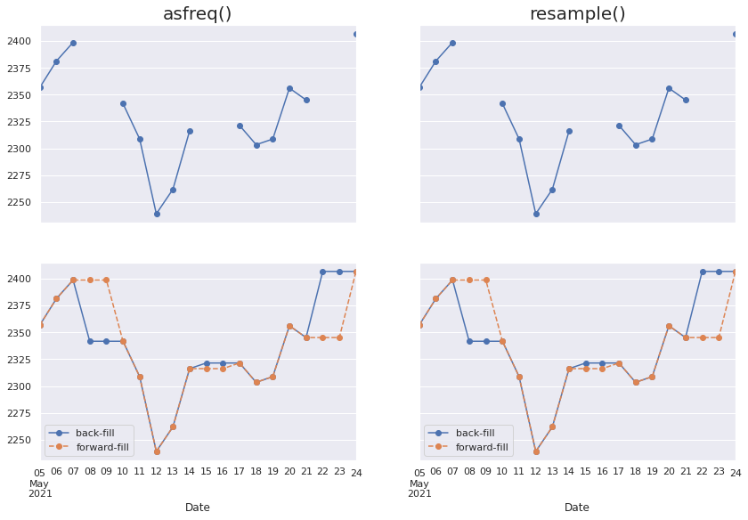
    


## Déplacements

Une autre opération fondamentale de l'analyse des données temporelles est le déplacement ou décalage (on parle plus souvent de *time-shifts* ou *shifting*)

On utilise pour cette opération la méthode `shift()` dont le principe est de déplacer les valeurs par rapport aux indices. Le décalage doit bien sûr être un multiple de la fréquence !


```python
fig, ax = plt.subplots(3, sharey=True)

goog = goog.asfreq('D', method='ffill')

goog.plot(ax=ax[0])
goog.shift(900).plot(ax=ax[1])
goog.shift(-900).plot(ax=ax[2])

local_max = pd.to_datetime('2010-01-01')
offset1 = pd.Timedelta(900, 'D')
offset2 = pd.Timedelta(-900, 'D')

ax[0].legend(['close'], loc=2)
ax[0].get_xticklabels()[3].set(weight='heavy', color='red')
ax[0].axvline(local_max, alpha=0.3, color='red')

ax[1].legend(['shift(900)'], loc=2)
ax[1].get_xticklabels()[3].set(weight='heavy', color='red')
ax[1].axvline(local_max + offset1, alpha=0.3, color='red')

ax[2].legend(['shift(-900)'], loc=2)
ax[2].get_xticklabels()[3].set(weight='heavy', color='red')
ax[2].axvline(local_max + offset2, alpha=0.3, color='red');
```


    
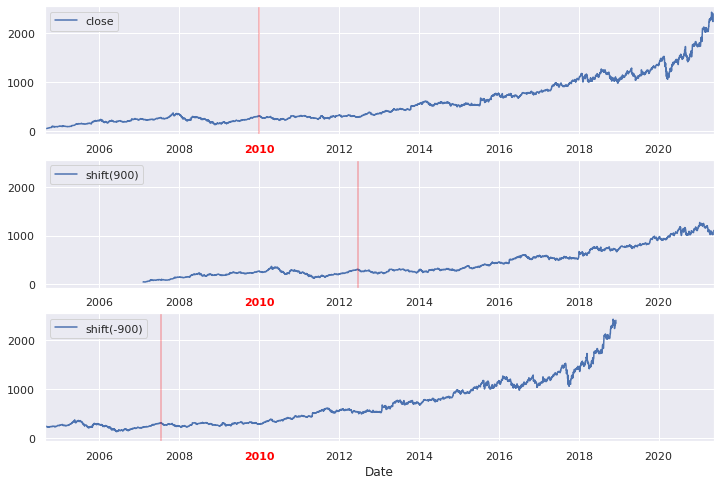
    


Une utilisation possible du *shifting* est par exemple de calculer le retour sur investissement à 1 an de l'action de Google (ROI - *return on investment*, par ici <a href="https://en.wikipedia.org/wiki/Return_on_investment" target="_blank">Wiki</a>).


```python
ROI_1 = 100 * (goog.shift(-365) / goog - 1)
ROI_1.iloc[:-365].plot()
plt.ylabel('ROI');
```


    
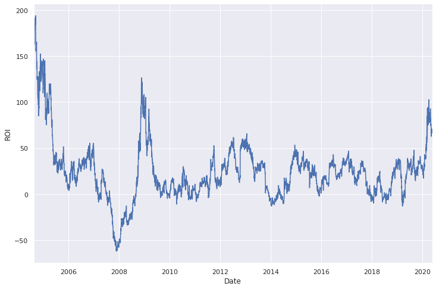
    


Qu'en conclure ? Pour les boursicoteurs, vous avez raté le coche, fallait acheter en 2004 ou en 2009.

## Attention, fenêtres glissantes

Enfin, la 3ème opération classique des séries temporelles consiste à calculer différentes statistiques sur une fenêtre d'une longueur donnée et qui se déplace. On parle plus de *rolling window* que de fenêtres glissantes...et pour ce faire, Pandas a tout ce qu'il faut avec la méthode `rolling()` pour les objets `Series` et `DataFrame`. Regardons d'un peu plus près en calculant avec la méthode rolling la moyenne annuelle centrée et l'écart-type annuel centré.


```python
rol = goog.rolling(365, center=True)

data = pd.DataFrame({'close': goog,
                     'moyenne': rol.mean(),
                     'std': rol.std()})
ax = data.plot(style=['-', '--', ':'])
ax.lines[0].set_alpha(0.4)
```


    
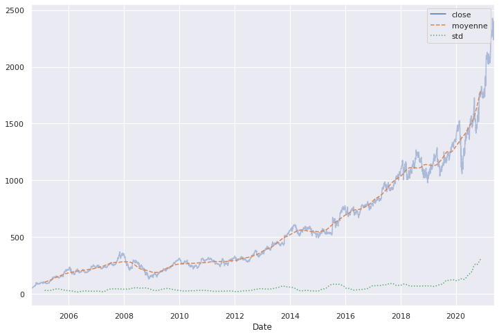
    
> 👋 Nous c'est Antoine et Louis de Statoscop, une coopérative de statisticiens / data scientists.
> Vous voulez en savoir plus sur ce que l'on fait?
<div class = "d-flex justify-content-center mt-4">
   <a href="https://statoscop.fr" target=_blank class="btn btn-primary btn-custom text-uppercase" type="button">Visiter notre site</a>
   <a href="https://statoscop.fr/contact" target=_blank class="btn btn-primary btn-custom text-uppercase" type="button">Nous contacter</a>
</div>
<br>    


# Un exemple de visualisation : le nombre de vélos à Paris Montparnasse

On va terminer sur un petit exemple un peu plus parlant, ou en tout cas, un peu moins financier, en regardant le nombre de vélos passés devant un des compteurs de la ville de Paris, situé sur le boulevard Montparnasse. Le jeu de données vient <a href="https://opendata.paris.fr/explore/dataset/comptage-velo-donnees-compteurs/information/?disjunctive.id_compteur&disjunctive.nom_compteur&disjunctive.id&disjunctive.name" target="_blank">de là</a>. On récupère ainsi le décompte horaire des vélos.

## Nettoyage des données 

Un premier coup d'oeil sur les données nous permet de voir qu'il y a beaucoup de colonnes inutiles dans ce dataset. On va donc se contenter de ce qui nous intéresse : le timestamp et le nombre de vélos. Avec un petit peu de nettoyage directement au moment de l'import dans le `pandas.read_csv`, ça donne :


```python
velo = pd.read_csv('data/comptage-velo-donnees-compteurs.csv', sep=';',
                   names=["nb", "date"], header=0,
                   usecols=[4,5])
velo.head(3)
```


<div>
<style scoped>
    .dataframe tbody tr th:only-of-type {
        vertical-align: middle;
    }

    .dataframe tbody tr th {
        vertical-align: top;
    }

    .dataframe thead th {
        text-align: right;
    }
</style>
<table border="1" class="dataframe">
  <thead>
    <tr style="text-align: right;">
      <th></th>
      <th>nb</th>
      <th>date</th>
    </tr>
  </thead>
  <tbody>
    <tr>
      <th>0</th>
      <td>21.0</td>
      <td>2020-04-01T07:00:00+02:00</td>
    </tr>
    <tr>
      <th>1</th>
      <td>21.0</td>
      <td>2020-04-01T09:00:00+02:00</td>
    </tr>
    <tr>
      <th>2</th>
      <td>14.0</td>
      <td>2020-04-01T12:00:00+02:00</td>
    </tr>
  </tbody>
</table>
</div>


En important le jeu de données, on voit ce "+02:00" qui définit en fait la timezone. Plusieurs solutions possibles pour gérer ce problème :  
- on peut utiliser les méthodes de manipulation de timezone avec `tz_convert` et `tz_localize`  
- on peut définir notre propre parser de date au moment de l'import en supprimant le "+02:00" avec un `split` par exemple.

Ci-dessous, ces 2 approches mises en oeuvre.


```python
pd.DatetimeIndex(pd.to_datetime(velo.date, utc=True)).tz_convert('Europe/Paris').tz_localize(None)
```


    DatetimeIndex(['2020-04-01 07:00:00', '2020-04-01 09:00:00',
                   '2020-04-01 12:00:00', '2020-04-01 15:00:00',
                   '2020-04-01 16:00:00', '2020-04-01 19:00:00',
                   '2020-04-01 20:00:00', '2020-04-01 21:00:00',
                   '2020-04-01 22:00:00', '2020-04-01 23:00:00',
                   ...
                   '2021-05-22 20:00:00', '2021-05-23 00:00:00',
                   '2021-05-23 02:00:00', '2021-05-23 03:00:00',
                   '2021-05-23 04:00:00', '2021-05-23 16:00:00',
                   '2021-05-23 19:00:00', '2021-05-24 02:00:00',
                   '2021-05-24 05:00:00', '2021-05-24 14:00:00'],
                  dtype='datetime64[ns]', name='date', length=10046, freq=None)


```python
velo = pd.read_csv('data/comptage-velo-donnees-compteurs.csv', sep=';',
                   names=["nb", "date"], header=0,
                   usecols=[4,5],
                   index_col="date",
                   parse_dates=True,
                   date_parser=lambda s: pd.to_datetime(s.split("+")[0])
                  )
# read_csv retourne un dataframe or on veut un objet Series, donc puisqu'on le veut, et qu'on l'a, ben on le prend.
velo = velo.nb
velo[:3]
```


    date
    2020-04-01 07:00:00    21.0
    2020-04-01 09:00:00    21.0
    2020-04-01 12:00:00    14.0
    Name: nb, dtype: float64


Regardons à quoi ressemble cette série temporelle du nombre de vélos sur le boulevard Montparnasse ! 


```python
velo.plot(legend=False)
plt.ylabel('Décompte horaire des vélos');
```


    
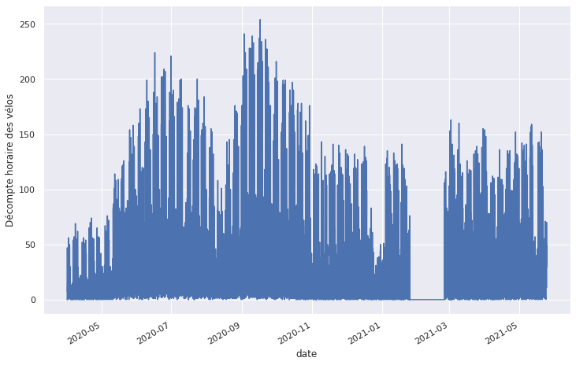
    


On voit pas grand chose pour le moment mais on détecte déjà un problème de valeurs manquantes au niveau du mois de février 2021. On va donc prendre les données de 2020 uniquement pour s'épargner la gestion de ces données manquantes.


```python
velo = velo['2020']
velo.plot(legend=False, figsize=(18,8))
plt.ylabel('Décompte horaire des vélos');
```


    
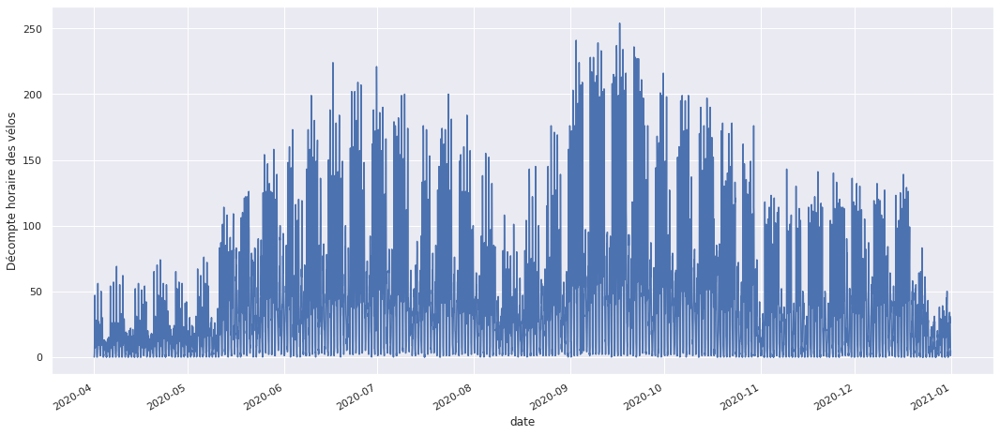
    

## Analyse des données 

La série par heure étant trop "dense" pour être clairement lisible, on va diminuer la fréquence avec un `resample` pour faire la somme des vélos sur une journée et sur une semaine.


```python
fig, ax = plt.subplots(1,2,figsize=(18,7))

# Somme sur une journée
velo_jr =  velo.resample('D').sum()
velo_jr.plot(ax=ax[0], legend=False)
ax[0].set_ylabel('Décompte journalier des vélos');

# Somme sur une semaine
velo_sem =  velo.resample('W').sum()
velo_sem.plot(ax=ax[1], legend=False)
ax[1].set_ylabel('Décompte hebdo des vélos');
```


    
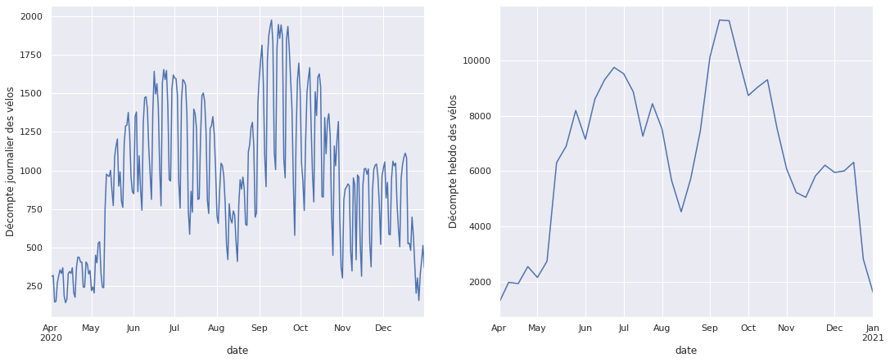
    


Avec ces rééchantillonages on veut une tendance annuelle qui se dégage avec notamment un pic de reprise d'activité au printemps, après le confinement et une baisse de fréquentation pendant l'été. De la même manière, la baisse significative visible au mois de novembre est certainement dûe au second confinement de 2020.

Une autre information visible sur le graphique des décomptes journaliers est la baisse du nombre de vélo environ 4 fois par mois, cela correspond certainement aux weekends mais ne nous avançons pas trop...

On va regarder avec la méthode `rolling`, la moyenne mobile mensuelle et faire jouer certains paramètres afin de voir ce qu'il en est.


```python
plt.figure(figsize=(20,12))
plt.plot(velo_jr.rolling(30, center=True).mean(),label="unweighted")

for std in [1,5,10,15,20,30]:
    plt.plot(velo_jr.rolling(30, center=True, win_type='gaussian').mean(std=std), label=f"win{std}")

plt.legend(loc='best');
```


    
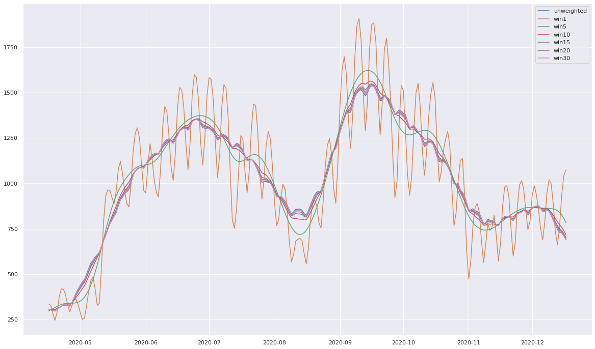
    


Le paramètre `win_type="gaussian"` permet d'appliquer une pondération au calcul de la moyenne. En l'occurence on applique des poids qui suivent une loi normale dont l'écart-type est défini dans la fonction d'aggrégation `mean`. Plus cet écart-type est faible, plus les jours proches comptent et ceux éloignés ne comptent pas. C'est le cas de la courbe orange qui a donc tendance à suivre d'assez près la courbe initiale. En revanche, si l'on augmente l'écart-type, on prend en compte plus de jours autour et on lisse ainsi les résultats. Pour finir, si l'écart-type est très élevé, alors on pondère de manière quasi identique les 30 jours de la fenêtre et on retombe donc sur une moyenne non-pondérée.

On va regarder maintenant comment ça se passe au niveau hebdomadaire pour comprendre comment évolue la fréquentation selon les différents horaires d'une journée et selon les différents jours d'une semaine. Pour cela, on va pouvoir utiliser les attributs `time` et `dayofweek` des objets `DatetimeIndex` afin d'afficher les décomptes de vélos par heure de la journée et par jour de la semaine.


```python
import numpy as np
fig, ax = plt.subplots(1,2,figsize=(18,7))

par_hr = velo.groupby(velo.index.time).mean()
heures = 4 * 60 * 60 * np.arange(6)
par_hr.plot(ax=ax[0], xticks=heures, legend=False);

par_sem = velo.groupby(velo.index.dayofweek).mean()
par_sem.index = ['Lundi', 'Mardi', 'Mercredi', 'Jeudi', 'Vendredi', 'Samedi', 'Dimanche']
par_sem.plot(ax=ax[1], legend=False);
```


    
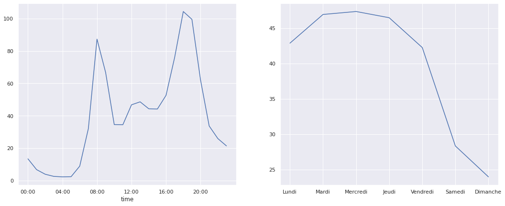
    


On retrouve bien certaines informations qu'on avait évoquées :   
- baisse de la fréquentation le weekend et sur une journée,  
- pics de fréquentation à 8h et à 18h et légère augmentation à l'heure du déjeuner.

Cette 2ème information est certes logique pour les jours ouvrables mais c'est plus étonnant pour les jours de weekends...allons voir de plus près !


```python
jours_ouvrables = np.where(velo.index.dayofweek < 5, 'Ouvrable', 'Weekend')
par_hr = velo.groupby([jours_ouvrables, velo.index.time]).mean()
```


```python
fig, ax = plt.subplots(1,2,figsize=(18,7))
par_hr.loc['Ouvrable'].plot(ax=ax[0], title='Jours ouvrables', xticks=heures, legend=False)
par_hr.loc['Weekend'].plot(ax=ax[1], title='Weekends', xticks=heures, legend=False);
```


    
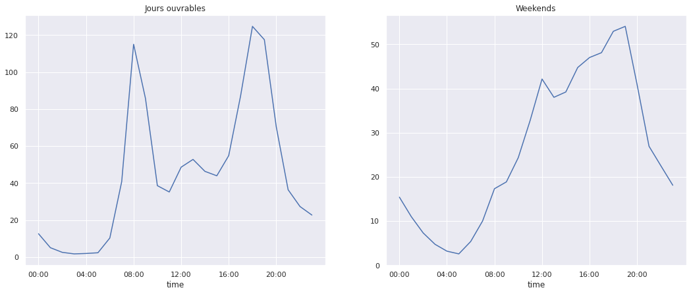
    


C'est tout de suite plus clair : le weekend, les gens dorment et sortent se promener l'après-midi ! Nous voilà rassurés. Sur cette belle découverte, on se dit à très vite pour le post numéro 3 de cette série ! Comme d'habitude, vous pouvez retrouver l'ensemble du notebook ayant servi à générer cette note sur le <a href="https://github.com/Statoscop/notebooks-blog" target="_blank">github de Statoscop</a>.
  

<div class = "d-flex justify-content-center mt-4">
   <a href="https://statoscop.fr" target=_blank class="btn btn-primary btn-custom text-uppercase" type="button">Visiter notre site</a>
   <a href="https://statoscop.fr/contact" target=_blank class="btn btn-primary btn-custom text-uppercase" type="button">Nous contacter</a>
</div>
<br>  