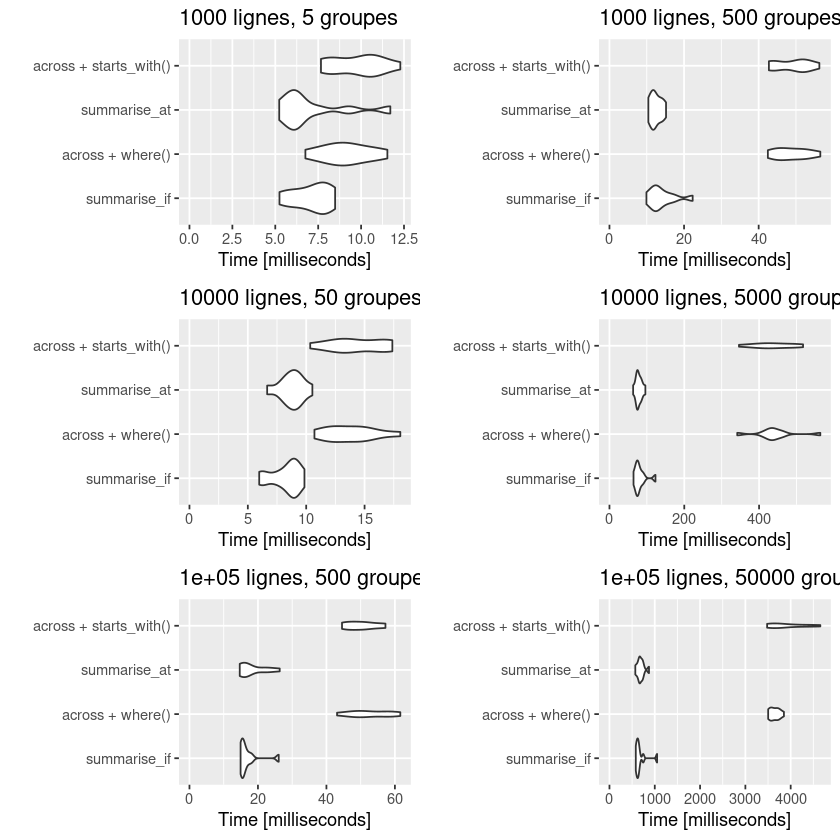

Title: Fonctionnement de across() dans dplyr
Author: Antoine Sireyjol
Date: '2020-08-27'
slug: fonctionnement-de-across-dans-dplyr
Category: R
Tags: dplyr, across, benchmark, rstats, R, tidyverse
Summary: On va faire du R pour changer!


Vous avez dû voir passer cette information : une mise à jour majeure de `dplyr` (version 1.0.0) est sortie il y a quelques mois! L'occasion de faire une nouvelle petite note sur un élément très important de cette nouvelle version : `across()`, un nouveau verbe pour réaliser des opérations sur plusieurs colonnes. On va le présenter rapidement et regarder ensuite ses performances en termes de vitesse d'exécution par rapport aux anciennes méthodes. On utilise la version `1.0.2` de dplyr, celle sur le CRAN à ce jour, et qui a justement été optimisée par rapport à la version `1.0.0`. Cette note est organisée en deux parties :  
- [`across()`, ça marche comment?][`across()`, ça marche comment?], où l'on présente les bases de `across()`.     
- [`across()`, ça tourne comment?][`across()`, ça tourne comment?], où l'on évalue la vitesse d'exécution par rapport aux anciennes méthodes.  

Si vous voulez balayer plus largement les différents éléments de la mise à jour de `dplyr`, vous pouvez vous rendre sur [le site du tidyverse](https://www.tidyverse.org/blog/2020/06/dplyr-1-0-0/) (en anglais) ou sur [cet article du blog de ThinkR](https://thinkr.fr/hey-quoi-de-neuf-dplyr-le-point-sur-la-v1/#La_fonction_de_calcul_avec_conditions_sur_les_variables_across()) (en français) qui en présentent les changements majeurs. 

# `across()`, ça marche comment?  

## Syntaxe de base  

Le verbe `across()` vise à remplacer toutes les fonctions suffixées par `_if`, `_at` et `_all`. Il regroupe ces méthodes dans une seule et permet ainsi de les associer, ce qui n'était pas possible avant. Il s'utilise dans `mutate` et `summarise`. La syntaxe associée à ce verbe est la suivante :   

```{R}
across(.cols, .fns)
```

 Dans laquelle :  
 - Les colonnes `.cols` peuvent être sélectionnées en utilisant la même syntaxe que pour la méthode `vars()` (nom des variables, `starts_with`, `end_with`, `contains`,...), mais aussi avec des conditions rentrées dans `where()` qui sélectionneront de la même manière que le faisaient les fonctions suffixées par `_if`.  
 - La fonction `.fns` est définie comme auparavant (le nom de la fonction ou sa définition "à la volée" avec `~ my_fun(.)`).  
 
## Quelques exemples  

Pour changer, on utilise pour ces petits exemples la table `penguins` promue par [Allison Horst](https://github.com/allisonhorst/palmerpenguins) pour remplacer l'usage de la table iris. Vous pouvez l'obtenir depuis le package `palmerpenguins` sur le CRAN. À partir de cette table, l'instruction visant à sortir la moyenne de toutes les variables numériques s'écrivait auparavant :  


```R
penguins %>% summarise_if(is.numeric, mean, na.rm = TRUE)
```


<table class="dataframe">
<caption>A tibble: 1 × 5</caption>
<thead>
	<tr><th scope=col>bill_length_mm</th><th scope=col>bill_depth_mm</th><th scope=col>flipper_length_mm</th><th scope=col>body_mass_g</th><th scope=col>year</th></tr>
	<tr><th scope=col>&lt;dbl&gt;</th><th scope=col>&lt;dbl&gt;</th><th scope=col>&lt;dbl&gt;</th><th scope=col>&lt;dbl&gt;</th><th scope=col>&lt;dbl&gt;</th></tr>
</thead>
<tbody>
	<tr><td>43.92193</td><td>17.15117</td><td>200.9152</td><td>4201.754</td><td>2008.029</td></tr>
</tbody>
</table>


Elle se réécrit avec `across()` en utilisant `where()` :  


```R
penguins %>% summarise(across(where(is.numeric), mean, na.rm = TRUE))
```


<table class="dataframe">
<caption>A tibble: 1 × 5</caption>
<thead>
	<tr><th scope=col>bill_length_mm</th><th scope=col>bill_depth_mm</th><th scope=col>flipper_length_mm</th><th scope=col>body_mass_g</th><th scope=col>year</th></tr>
	<tr><th scope=col>&lt;dbl&gt;</th><th scope=col>&lt;dbl&gt;</th><th scope=col>&lt;dbl&gt;</th><th scope=col>&lt;dbl&gt;</th><th scope=col>&lt;dbl&gt;</th></tr>
</thead>
<tbody>
	<tr><td>43.92193</td><td>17.15117</td><td>200.9152</td><td>4201.754</td><td>2008.029</td></tr>
</tbody>
</table>


Si l'on souhaite sélectionner à partir du nom des variables, la nouvelle syntaxe est la suivante :  


```R
# Ancienne version
penguins %>% summarise_at(vars(matches("bill*|flipper*")), mean, na.rm = TRUE)

# Avec across()
penguins %>% summarise(across(matches("bill*|flipper*"), mean, na.rm = TRUE))
```


<table class="dataframe">
<caption>A tibble: 1 × 3</caption>
<thead>
	<tr><th scope=col>bill_length_mm</th><th scope=col>bill_depth_mm</th><th scope=col>flipper_length_mm</th></tr>
	<tr><th scope=col>&lt;dbl&gt;</th><th scope=col>&lt;dbl&gt;</th><th scope=col>&lt;dbl&gt;</th></tr>
</thead>
<tbody>
	<tr><td>43.92193</td><td>17.15117</td><td>200.9152</td></tr>
</tbody>
</table>


<table class="dataframe">
<caption>A tibble: 1 × 3</caption>
<thead>
	<tr><th scope=col>bill_length_mm</th><th scope=col>bill_depth_mm</th><th scope=col>flipper_length_mm</th></tr>
	<tr><th scope=col>&lt;dbl&gt;</th><th scope=col>&lt;dbl&gt;</th><th scope=col>&lt;dbl&gt;</th></tr>
</thead>
<tbody>
	<tr><td>43.92193</td><td>17.15117</td><td>200.9152</td></tr>
</tbody>
</table>


On note également qu'on peut combiner dorénavant les sélections sur les types des colonnes et sur leur nom dans une seule instruction `across()`, ce qui n'était pas possible avant. Pour enlever les années des moyennes numériques, on peut par exemple écrire :   


```R
penguins %>% summarise(across(where(is.numeric) & -contains("year"), mean, na.rm = TRUE))
```


<table class="dataframe">
<caption>A tibble: 1 × 4</caption>
<thead>
	<tr><th scope=col>bill_length_mm</th><th scope=col>bill_depth_mm</th><th scope=col>flipper_length_mm</th><th scope=col>body_mass_g</th></tr>
	<tr><th scope=col>&lt;dbl&gt;</th><th scope=col>&lt;dbl&gt;</th><th scope=col>&lt;dbl&gt;</th><th scope=col>&lt;dbl&gt;</th></tr>
</thead>
<tbody>
	<tr><td>43.92193</td><td>17.15117</td><td>200.9152</td><td>4201.754</td></tr>
</tbody>
</table>


Enfin, le paramètre `.names` de `across()` est également très pratique et permet notamment dans une instruction `mutate()` de créer de nouvelles colonnes nommées à partir des anciennes auxquelles on peut se référer avec `.col`. Par exemple, si je veux créer deux nouvelles colonnes passant les informations sur le bec en pouces mais en conservant les anciennes colonnes, je peux écrire :  


```R
penguins %>% 
  mutate(across(starts_with("bill"), ~ . * 0.04, .names = "pouces_{.col}")) %>% 
  select(contains("bill")) %>% head(5)
```


<table class="dataframe">
<caption>A tibble: 5 × 4</caption>
<thead>
	<tr><th scope=col>bill_length_mm</th><th scope=col>bill_depth_mm</th><th scope=col>pouces_bill_length_mm</th><th scope=col>pouces_bill_depth_mm</th></tr>
	<tr><th scope=col>&lt;dbl&gt;</th><th scope=col>&lt;dbl&gt;</th><th scope=col>&lt;dbl&gt;</th><th scope=col>&lt;dbl&gt;</th></tr>
</thead>
<tbody>
	<tr><td>39.1</td><td>18.7</td><td>1.564</td><td>0.748</td></tr>
	<tr><td>39.5</td><td>17.4</td><td>1.580</td><td>0.696</td></tr>
	<tr><td>40.3</td><td>18.0</td><td>1.612</td><td>0.720</td></tr>
	<tr><td>  NA</td><td>  NA</td><td>   NA</td><td>   NA</td></tr>
	<tr><td>36.7</td><td>19.3</td><td>1.468</td><td>0.772</td></tr>
</tbody>
</table>


# `across()`, ça tourne comment?  
À la sortie de la mise à jour de `dplyr`, il avait été signalé que la méthode `across()` impliquerait peut-être de légères pertes en termes de vitesse d'exécution par rapport aux anciennes méthodes `_at`, `_if` et `_all`. Une partie de ce retard a été apparemment rattrapé dans les dernières mises à jour et donc dans la version `1.0.2` que l'on utilise dans cet article. Sur le modèle de ce que l'on a proposé dans un [article précédent](https://antoinesir.rbind.io/post/vitesses-d-agr%C3%A9gation-de-data-table-et-dplyr/), on va comparer les instructions `_if` et `_at` d'un summarise groupé avec leurs équivalents dans `across()` pour différentes tailles d'échantillons et de groupes.   

Le tibble utilisé a le format suivant, ici pour 100 lignes et deux groupes :  


```R
nbrow <- 100
nbgpe <- 2
as_tibble(data.frame(x1 = rnorm(nbrow), x2 =  rnorm(nbrow), 
                     x3 = runif(nbrow), x4 = runif(nbrow),
                     y = as.factor(sample(floor(nbgpe), replace = TRUE))
                               )) %>% 
  arrange(x1) %>% head(5)
```


<table class="dataframe">
<caption>A tibble: 5 × 5</caption>
<thead>
	<tr><th scope=col>x1</th><th scope=col>x2</th><th scope=col>x3</th><th scope=col>x4</th><th scope=col>y</th></tr>
	<tr><th scope=col>&lt;dbl&gt;</th><th scope=col>&lt;dbl&gt;</th><th scope=col>&lt;dbl&gt;</th><th scope=col>&lt;dbl&gt;</th><th scope=col>&lt;fct&gt;</th></tr>
</thead>
<tbody>
	<tr><td>-2.738078</td><td> 1.12303171</td><td>0.84041535</td><td>0.66216821</td><td>2</td></tr>
	<tr><td>-2.418178</td><td>-0.18281610</td><td>0.01449968</td><td>0.22480163</td><td>2</td></tr>
	<tr><td>-2.038240</td><td>-0.48819836</td><td>0.47085237</td><td>0.42920691</td><td>2</td></tr>
	<tr><td>-1.961096</td><td> 0.49787841</td><td>0.48345918</td><td>0.61128447</td><td>2</td></tr>
	<tr><td>-1.853462</td><td>-0.03496033</td><td>0.22337675</td><td>0.05563201</td><td>2</td></tr>
</tbody>
</table>


Les différentes instructions testées sont les suivantes :  

```R
# summarise_if  
data %>% group_by(y) %>% summarise_if(is.numeric, mean) 

# across + where()  
data %>% group_by(y) %>% summarise(across(where(is.numeric), mean))  

# summarise_at  
data %>% group_by(y) %>% summarise_at(vars(starts_with("x")), mean) 

# across + starts_with()  
data %>% group_by(y) %>% summarise(across(starts_with("x"), mean))
```

Les résultats du `microbenchmark()` pour les différentes combinaisons de nombres de groupes et de lignes sont présentés dans un graphique qui représente la distribution du temps d’exécution des 10 occurences testées pour chaque méthode :     


```R
library(microbenchmark)
library(ggplot2)
test_group_by <- function(nbrow, nbgpe){
  test <- as_tibble(data.frame(x1 = rnorm(nbrow), x2 =  rnorm(nbrow), 
                               x3 = runif(nbrow), x4 = runif(nbrow),
                               y = as.factor(sample(floor(nbgpe), 
                                                    replace = TRUE))
                               ))
  return(autoplot(
    microbenchmark::microbenchmark(times = 10, unit="ms", 
                                   summarise_if = test %>% group_by(y) %>% summarise_if(is.numeric, mean),
                                   "across + where()" = test %>% group_by(y) %>% summarise(across(where(is.numeric), mean)),
                                   summarise_at = test %>% group_by(y) %>% summarise_at(vars(starts_with("x")), mean),
                                   "across + starts_with()" = test %>% group_by(y) %>% summarise(across(starts_with("x"), mean))
                                   ),
    log = FALSE)
    + ggtitle(paste0(nbrow, " lignes, ", nbgpe, " groupes")) + expand_limits(y = 0))}
```


```R
x <- 100
y <- 0.5
for (i in seq(1, 3)){
  x <- x * 10
  y <- y * 10
  assign(paste0("plot", i, sep = ""), test_group_by(x, y))
}
x <- 100
y <- 50
for (i in seq(4, 6)){
  x <- x * 10
  y <- y * 10
  assign(paste0("plot", i, sep = ""), test_group_by(x, y))
}

library(gridExtra)
grid.arrange(plot1, plot4, plot2, plot5, plot3, plot6, ncol = 2, heights = c(14, 14, 14))
```
    





On constate en effet une moins bonne performance en termes de vitesse d'exécution des instructions utilisant le verbe `across()`. Les différences sont surtout marquées dans le cas où il y a beaucoup de groupes par rapport au nombre de lignes (colonne de droite) et ce quelque soit le nombre de lignes. Elles sont moins importantes dans le cas où il y a peu de groupes par rapport au nombre de lignes (colonne de gauche). 
