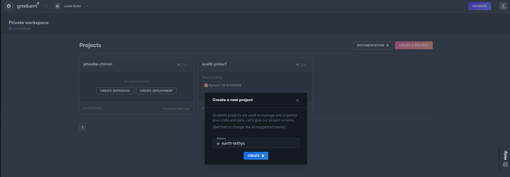
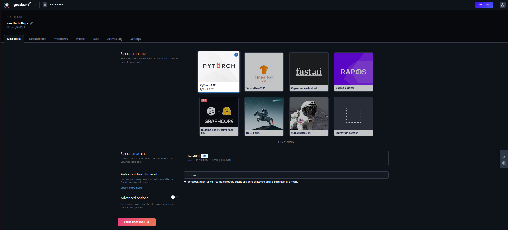
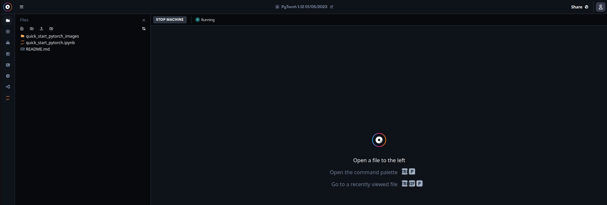

Title: Entraînement de Yolo V7 sur des données personnelles
Author: Louis
Date: '2023-01-09'
Slug: yolov7-gradient
Category: Python, Deep Learning
Tags: Python, PyTorch, Machine Learning, Deep Learning, Computer Vision, Object Detection, Image segmentation, Yolo, Paperspace, Paperspace Gradient, GPU training, GPU cloud
Cover: images/cover_14.jpg
Summary: Entraînement de Yolo V7 sur des données personnelles et sans GPU hardware

[TOC]  

Vous avez très envie d'utiliser Yolo V7 sur votre problématique de reconnaissance d'objet ou de segmentation mais vous n'avez pas de gros ordinateur avec une groooosse carte graphique pour faire de grooooooooooos calculs d'optimisation de poids. Pas de panique, il y a des solutions et on vous en propose une ici.

# Utilisation du GPU

Le petite magicien qui rend l'entraînement des modèles de deep learning très profonds, c'est lui : le GPU. *Cool mais déjà c'est quoi ? Et puis comment je fais si j'en ai pas ?*

## Le GPU

Une unité de traitement graphique ou GPU (*Graphics Processing Unit*) est une puce informatique pour traiter les tâches de rendu graphique. Les GPU sont conçus pour effectuer de nombreux calculs simultanément, ce qui les rend particulièrement efficaces pour le rendu graphiques 2D/3D ou le traitement de vidéos mais pas seulement. Le GPU fonctionne conjointement avec le CPU et permet, en fonctionnant spécialement pour le rendu images, de libérer de la puissance de traitement pour le CPU qui peut se consacrer aux autres tâches sans limiter les performances de la carte graphique.

Le GPU est généralement disposé sur la carte graphique (d'où la confusion parfois entre les 2) mais pas nécessairement. En effet la puce GPU peut être intégrée à un CPU sur le même circuit, sur une carte graphique ou dans la carte mère d'un ordinateur ou d'un serveur. 

## GPU, CPU, JSUIPERDU...

Un GPU est plus efficace qu'un CPU pour le rendu d'images grâce à son architecture de traitement parallèle lui permettant d'effectuer de nombreux calculs simultanément. Un seul CPU ne dispose pas de cette fonctionnalité (bien que ce soit possible avec des processeurs multicœurs). En revanche un CPU a une fréquence plus élevée et peut effectuer un calcul plus rapidement qu'un GPU.

Pour résumer, le GPU est conçu pour le parallélisme des données et pour appliquer la même opération à plusieurs éléments de données (SIMD pour *Single Instruction to Multiple Data*) tandis qu'un CPU est conçu pour le parallélisme des tâches et l'exécution de différentes opérations non liées.

Si votre ordinateur est forcément équipé d'un CPU, il n'a pas nécessairement de GPU puisque le chipset de la carte mère peut gérer le rendu graphique (beaucoup moins bien qu'une carte graphique certes).

## GPU et *Deep Learning*

*"Bon ok, je suis toujours pas spécialiste, mais je vois le principe. Par contre, on était pas sur YoloV7 nous ?"*  

YoloV7 est un réseau de neurones à convolution qui a quasi 37 millions de paramètres...lorsque vous souhaitez utiliser le modèle déjà entraîné sur le jeu de données [COCO](https://cocodataset.org/#home), pas de problèmes de hardware, ça fonctionnera sans ressources supplémentaires. Si par contre vous voulez ré-entraîner le modèle sur vos données, là ça se complique et si vous n'avez pas de GPU, vous avez intérêt à avoir énormément de temps devant vous, et d'ailleurs ça ne suffira même pas, car alors c'est la mémoire qui vous manquera.

Sans entrer dans les détails de l'optimisation de réseau de neurones, les opérations à effectuer sont des calculs matriciels pas tellement complexe mais répétitifs et surtout, extrêmement nombreux. La parallélisation de ces opérations sur un GPU est donc idéale et nécessaire pour optimiser le réseau dans un temps viable.

## Les sevices de GPU cloud

*"On y voit un peu plus clair...mais comment on fait quand on en a pas ?"*

Puisqu'on a pas les capacités localement, on va le faire à distance grâce aux services Cloud qui proposent du GPU. Ils sont nombreux (Linode, Paperspace, Google Cloud GPUs, Elastic GPU Service, Azure N series, IBM Cloud, AWS and NVIDIA, OVHcloud, etc...) mais on va s'en tenir a un : [Paperspace](https://www.paperspace.com/). L'intérêt est d'utiliser [Paperspace Gradient](https://www.paperspace.com/gradient) qui facilite la création de machine avec des templates intégrés (au hasard, PyTorch), l'utilisation et l'entraînement de modèles à parir de notebooks. Si on le souhaite, on peut louer directement du GPU avec Paperspace CORE.

# Cas pratique : la reconnaissance de déchets

L'objectif est d'entraîner le modèle Yolo V7 à identifier et reconnaître des déchets. On utilisera pour cela le dataset [TACO](http://tacodataset.org/) et on va faire l'entraînement sur Paperspace Gradient.

## Gradient Paperspace

Que ce soit clair, on pas de parts dans Paperspace, c'est juste un des fournisseurs de GPU cloud et que Gradient est bien pensé pour des problématiques Machine Learning. Évidemment, si vous souhaitez utiliser un autre fournisseur et y faire tourner ce notebook, c'est tout à fait possible, il faudra juste d'installer sur votre VM l'ensemble des dépendances nécessaires et notamment jupyter. Ceci étant dit, voilà comment faire avec Gradient :

1. Créez un compte sur [Paperspace](https://console.paperspace.com/signup)  
2. Créez un projet  

3. Dans votre projet, créez un notebook en choisissant un template (PyTorch par exemple ou bien From Scratch) et un type de GPU selon votre compte et la disponibilité  

4. Bienvenus sur votre VM avec son GPU associé qui doit avoir le statut "Running", vous pouvez uploader un notebook par exemple celui-ci  


On s'étendra pas plus sur cette partie qui est spécifique à Gradient et pas aux services de GPU cloud en général. On vous laisse creuser si vous le souhaitez mais considérons à partir de maintenant que tout le code qui suit est exécuté directement dans l'IDE Jupyter Lab de notre VM Gradient (Jupyter Lab est disponible dans le barre d'outils à gauche).

## Le dataset TACO

On ne détaillera pas ici le traitement du dataset car ce n'est pas l'objet de cette note. En revanche, le notebook [TACO_dataset](https://github.com/Statoscop/notebooks-blog/tree/main/Entrainer%20YoloV7/TACO_dataset.ipynb) reprend l'ensemble des opérations concernant le jeu de données, à savoir :

1. clonage du repo TACO  
2. installation du `requirements.txt`  
3. récupération des images annotées au format YOLO
4. exploration du dataset avec les fonctions disponibles dans le script [`cocoviz.py`](https://github.com/Statoscop/notebooks-blog/tree/main/Entrainer%20YoloV7/cocoviz.py)
5. transformation des annotations du format COCO au format YOLO. Encore une fois, on explicite pas ici cette transformation mais quelques éléments toutefois : COCO utilise un seul fichier json dans lequel il stocke toutes les annotations de toutes les images avec des positions absolues alors que YOLO utilise des positions relatives et normalisées dans un fichier txt par image  
6. modification des classes pour ne garder que les super-catégories : ce n'est pas optimal pour la détection d'objets mais ça permet de simplifier un peu ce cas pratique théorique où le pouvoir prédictif de notre modèle n'a pas une grande importance

Vous pouvez uploader ce notebook [TACO_dataset](https://github.com/Statoscop/notebooks-blog/tree/main/Entrainer%20YoloV7/TACO_dataset.ipynb) sur Gradient et l'exécuter directement pour télécharger les images, annotations et effectuer l'ensemble des prétraitements. À la fin de l'exécution, vous disposerez donc, sur votre VM, des données prêtes (ou presque) à être utilisées pour l'entraînement de YoloV7. On y vient.

## L'entraînement de YoloV7

### Récupération du code de YoloV7

On clone directement le dépôt de [yolov7](https://github.com/WongKinYiu/yolov7.git) pour pouvoir réentrainer le modèle sur nos données. Bien noter que le repo sera cloné sur votre VM Gradient d'où vous exécuter ce notebook.


```python
!git clone https://github.com/WongKinYiu/yolov7.git
```

    Clonage dans 'yolov7'...
    remote: Enumerating objects: 1127, done.
    remote: Counting objects: 100% (29/29), done.
    remote: Compressing objects: 100% (25/25), done.
    remote: Total 1127 (delta 12), reused 14 (delta 4), pack-reused 1098
    Réception d'objets: 100% (1127/1127), 69.96 Mio | 16.98 Mio/s, fait.
    Résolution des deltas: 100% (522/522), fait.


On installe ensuite les dépendances nécessaires de YoloV7. Selon la machine GPU choisie sur Gradient, vous pourrez avoir besoin ou pas de downgrader les versions de `Torch` et `Torchvision`. Ici c'était le cas avec une VM A4000.


```python
!pip install -r ./yolov7/requirements.txt
!pip install setuptools==59.5.0
!pip install torchvision==0.11.3+cu111 -f https://download.pytorch.org/whl/cu111/torch_stable.html
```

    Requirement already satisfied: matplotlib>=3.2.2 in /usr/local/lib/python3.9/dist-packages (from -r ./yolov7/requirements.txt (line 4)) (3.5.2)
    Requirement already satisfied: numpy>=1.18.5 in /usr/local/lib/python3.9/dist-packages (from -r ./yolov7/requirements.txt (line 5)) (1.23.1)
    Requirement already satisfied: opencv-python>=4.1.1 in /usr/local/lib/python3.9/dist-packages (from -r ./yolov7/requirements.txt (line 6)) (4.6.0.66)
    Requirement already satisfied: Pillow>=7.1.2 in /usr/local/lib/python3.9/dist-packages (from -r ./yolov7/requirements.txt (line 7)) (9.2.0)
    Requirement already satisfied: PyYAML>=5.3.1 in /usr/local/lib/python3.9/dist-packages (from -r ./yolov7/requirements.txt (line 8)) (5.4.1)

       [............]

    WARNING: Running pip as the 'root' user can result in broken permissions and conflicting behaviour with the system package manager. It is recommended to use a virtual environment instead: https://pip.pypa.io/warnings/venv
    Looking in links: https://download.pytorch.org/whl/cu111/torch_stable.html
    Collecting torchvision==0.11.3+cu111
      Downloading https://download.pytorch.org/whl/cu111/torchvision-0.11.3%2Bcu111-cp39-cp39-linux_x86_64.whl (24.5 MB)
         ━━━━━━━━━━━━━━━━━━━━━━━━━━━━━━━━━━━━━━━━ 24.5/24.5 MB 63.2 MB/s eta m0:00:0000:0100:01
    Requirement already satisfied: pillow!=8.3.0,>=5.3.0 in /usr/local/lib/python3.9/dist-packages (from torchvision==0.11.3+cu111) (9.2.0)
    Collecting torch==1.10.2
      Downloading https://download.pytorch.org/whl/cu111/torch-1.10.2%2Bcu111-cp39-cp39-linux_x86_64.whl (2137.7 MB)
         ━━━━━━━━━━━━━━━━━━━━━━━━━━━━━━━━━━━━━━━━ 2.1/2.1 GB 1.2 MB/s eta m0:00:00:00:0100:02m
    Requirement already satisfied: numpy in /usr/local/lib/python3.9/dist-packages (from torchvision==0.11.3+cu111) (1.23.1)
    Requirement already satisfied: typing-extensions in /usr/local/lib/python3.9/dist-packages (from torch==1.10.2->torchvision==0.11.3+cu111) (4.3.0)
    Installing collected packages: torch, torchvision
      Attempting uninstall: torch
        Found existing installation: torch 1.12.1
        Uninstalling torch-1.12.1:
          Successfully uninstalled torch-1.12.1
      Attempting uninstall: torchvision
        Found existing installation: torchvision 0.13.1
        Uninstalling torchvision-0.13.1:
          Successfully uninstalled torchvision-0.13.1
    ERROR: pip's dependency resolver does not currently take into account all the packages that are installed. This behaviour is the source of the following dependency conflicts.
    torchaudio 0.12.0+cu116 requires torch==1.12.0, but you have torch 1.10.2+cu111 which is incompatible.
    Successfully installed torch-1.10.2+cu111 torchvision-0.11.3+cu111
    WARNING: Running pip as the 'root' user can result in broken permissions and conflicting behaviour with the system package manager. It is recommended to use a virtual environment instead: https://pip.pypa.io/warnings/venv
    

À ce stade, vous avez vos données ainsi que le code et les dépendances pour pouvoir l'utiliser. Il n'y donc plus qu'à entraîner.  
*"Ah oui mais non mon petit bonhomme, on va pas entraîner un modèle sur toutes nos données, sans faire de découpage échantillons entraînement/validation/test"* me direz-vous...

### Train test split

Si elle n'est pas au coeur de notre article, le *train test split* reste une étape fondamentale pour l'entraînement de tout modèle de machine learning. On présente donc la streatégie utilisée, une méthode "à la main" à partir des noms d'images en créant des dossiers associés à chaque sous-échantillons. On met directement les datasets `train`, `val`, `test` ainsi que le fichier .yaml associé dans le repo yolov7 pour l'entraînement puisque c'est à partir de ce repo, en utilisant le script `train.py` qu'on va réentrainer le modèle YoloV7.

**Petite note en passant :** le fichier .yaml dont on parle est le fichier de configuration de l'entraînement. Il contient comme informations les chemins des différents datasets ainsi que le nombre de catégories à identifier et leur nom. On le crée directement dans la cellule ci-dessous.


```python
import json
import os
import random
from tqdm import tqdm
import shutil
import datetime
import re
```


```python
# Split dataset

# read json file
with open('./TACO/data/images/annotations_wo_subdir.json', 'r+') as file:
    json_file = json.load(file)
    
# create directories (with replacement if exists)
for dirname in ['train', 'val', 'test']:
    dirpath = f"./yolov7/data/TACOpoly/{dirname}"
    if os.path.exists(dirpath):
        shutil.rmtree(dirpath)
    os.makedirs(dirpath + '/images')
    os.makedirs(dirpath + '/labels')
    
# create yaml file (with replacement if exists)
cats = [cat['name'] for cat in json_file['categories']]

with open('./yolov7/data/TACOpoly.yaml', 'w') as f:
    f.write(
f"""train: ./data/TACOpoly/train/images
val: ./data/TACOpoly/val/images
test: ./data/TACOpoly/test/images

nc: {len(cats)}
names: {cats}""")
    
    
# read json annotations file
with open('./TACO/data/images/annotations_wo_subdir.json', 'r+') as file:
    json_file = json.load(file)

# get images names and shuffle
img_names = [img['file_name'].split('.')[0] for img in json_file['images']]
random.shuffle(img_names)

# create a splitting dictionnary
split = {
    'train' : img_names[:1200],
    'val' : img_names[1200:1400],
    'test' : img_names[1400:]
}

# copy each image and its label in the right directory
for setname, sample in split.items():
    print(f"Copying images to {setname.upper()} directory")
    for imgname in tqdm(sample):
        shutil.copy(f"./TACO/data/images/{imgname}.jpg", f"./yolov7/data/TACOpoly/{setname}/images/{imgname}.jpg")
        shutil.copy(f"./TACO/data/labels_poly/{imgname}.txt", f"./yolov7/data/TACOpoly/{setname}/labels/{imgname}.txt")
```

    Copying images to TRAIN directory
    100%|██████████| 1200/1200 [01:50<00:00, 10.84it/s]
    Copying images to VAL directory
    100%|██████████| 200/200 [00:17<00:00, 11.56it/s]
    Copying images to TEST directory
    100%|██████████| 100/100 [00:08<00:00, 11.31it/s]


Voilà, cette fois plus de contretemps, on est paré pour l'entraînement.

### Entraînement

Pour gagner du temps, on ne va pas repartir de zéro avec des poids initiaux complétement aléatoires mais on va charger les poids d'un modèle pré-entraîné. On doit dans un premier temps télécharger ces poids puis lancer l'entraînement sur nos données. Pour cela, on se place dans le repo yolov7 et on télécharge les poids en question.


```python
%cd /notebooks/yolov7
```

    /notebooks/yolov7


```python
if os.path.exists('yolov7_training.pt'):
    print("Déjà téléchargé")
else:
    !wget https://github.com/WongKinYiu/yolov7/releases/download/v0.1/yolov7_training.pt
```

    Déjà téléchargé


La fonction `get_last_weights` ci-dessous n'est pas du tout nécessaire à l'entraînement de YoloV7 mais peut avoir son utilité. Je vous invite donc à regarder rapidement ce qu'elle fait sans pour autant vous y attarder.

**Une petite explication quand même :** les machines Gradient s'arrête automatiquement au bout de 6 heures ce qui n'est pas mal mais pas assez pour atteindre de bonnes performances du modèle. Il faudra donc relancer l'entraînement plusieurs fois pour atteindre un nombre d'époques suffisant. Deux stratégies sont possibles :

1. la plus évidente : on lance dès le départ un entraînement avec un grand d'époques et si la machine se stoppe, alors il suffira de relancer l'entraînement avec l'option `--resume` qui offre la possibilité de reprendre l'entraînement où il s'était arrêté (`!python train.py --resume`). Le problème de cette méthode est que `train.py` sauvegarde des poids intermédiaires tout au long de l'entraînement et que ces fichiers sont lourds. Il faudra donc supprimer en partie ces fichiers à la main avant de relancer l'entraînement pour éviter d'atteindre le plafond de stockage offert par Gradient.
2. un approche plus maîtrisée : on fait un nombre d'époques plus restreint dont on sait qu'il sera terminé en moins de 6 heures et on repart à chaque fois du meilleur poids du dernier entraînement. La fonction `get_last_weights` récupère simplement ces meilleurs derniers poids. Cela va permettre de ne pas garder en mémoire les autres fichiers de poids en les supprimant dès la nouvelle série d'époques terminée.


```python
def get_last_weights(modelname):
    """
    This function retrieves the best weights from the last training in order to
    restart new traing from those weights.
    
    Parameters
    ----------
    modelname : str
        Name of the model (such as --name argument from Yolov7 train.py script).
        This is the name looked for in the yolov7/runs/train directory.
    nb_epochs : int
        Number of epochs done per each training.

    Returns
    -------
    str :
        Path to weights used to initiate new training.
    int :
        Number of epochs already trained.  
    """
        
    # keep only directories containg modelname in their name
    train_dirs = []
    for dirname in os.listdir('/notebooks/yolov7/runs/train/'):
        if modelname in dirname:
            train_dirs.append(dirname)
    train_dirs.sort()
    
    # returns yolov7_training weights and 0 epochs if never trained
    if len(train_dirs) == 0:
        return 'yolov7_training.pt', 0

    # else retrieve the last weights and compute number of epochs
    # this assumes that the number of epochs is the same over each training
    nmax = 0
    for dirname in train_dirs:
        if dirname.split(modelname)[-1] == '' :
            dirmax = dirname
        else:
            n = int(dirname.split(modelname)[-1])
            if n > nmax :
                nmax = n
                dirmax = dirname

    return f"runs/train/{dirmax}/weights/best.pt"
```

Cette fois ça y est. C'est vraiment le moment de l'entraînement ! Pour ce qui concerne les différents paramètres passés en arguments de la commande `python train.py`, vous êtes cordialement conviés à regarder du côté de l'aide pour y voir plus clair. Allez, on arrête de bosser et on laisse le GPU transpirer un peu. 

<iframe src="https://giphy.com/embed/l4FATJpd4LWgeruTK" width="480" height="270" frameBorder="0" class="giphy-embed" allowFullScreen></iframe>


```python
epochs_per_training = 150
init_weights = get_last_weights('TACOpoly')
start = datetime.datetime.now()

print(f"ENTRAÎNEMENT DÉBUTÉ À {start.strftime('%H:%M')} AVEC LES POIDS INITIAUX {init_weights}")
print(f"_________________________________________________________________")


!python train.py --workers 8 --device 0 --batch-size 16 --data data/TACOpoly.yaml --img 640 640 \
    --cfg cfg/training/yolov7.yaml --weights {init_weights} --name TACOpoly \
    --hyp data/hyp.scratch.custom.yaml --epochs {epochs_per_training}

print(f"_________________________________________________________________")
print(f"DURÉE DE L'ENTRAÎNEMENT : {datetime.datetime.now() - start}")
```

    ENTRAÎNEMENT DÉBUTÉ À 10:24 AVEC LES POIDS INITIAUX runs/train/TACOpoly7/weights/best.pt
    _________________________________________________________________
    YOLOR 🚀 v0.1-115-g072f76c torch 1.10.2+cu111 CUDA:0 (NVIDIA RTX A4000, 16117.3125MB)
    
    Namespace(weights='runs/train/TACOpoly7/weights/best.pt', cfg='cfg/training/yolov7.yaml', data='data/TACOpoly.yaml', hyp='data/hyp.scratch.custom.yaml', epochs=150, batch_size=16, img_size=[640, 640], rect=False, resume=False, nosave=False, notest=False, noautoanchor=False, evolve=False, bucket='', cache_images=False, image_weights=False, device='0', multi_scale=False, single_cls=False, adam=False, sync_bn=False, local_rank=-1, workers=8, project='runs/train', entity=None, name='TACOpoly', exist_ok=False, quad=False, linear_lr=False, label_smoothing=0.0, upload_dataset=False, bbox_interval=-1, save_period=-1, artifact_alias='latest', freeze=[0], v5_metric=False, world_size=1, global_rank=-1, save_dir='runs/train/TACOpoly8', total_batch_size=16)

       [............]
    
         Epoch   gpu_mem       box       obj       cls     total    labels  img_size
       145/149       11G  0.008686  0.003024 0.0004638   0.01217        82       640
                   Class      Images      Labels           P           R      mAP@.5
                     all         200         648        0.43       0.204       0.194       0.162
    
         Epoch   gpu_mem       box       obj       cls     total    labels  img_size
       146/149       11G  0.008719  0.003078 0.0004409   0.01224        52       640
                   Class      Images      Labels           P           R      mAP@.5
                     all         200         648       0.555        0.18       0.193        0.16
    
         Epoch   gpu_mem       box       obj       cls     total    labels  img_size
       147/149       11G  0.008701  0.003087 0.0005799   0.01237        89       640
                   Class      Images      Labels           P           R      mAP@.5
                     all         200         648       0.427       0.212       0.193       0.161
    
         Epoch   gpu_mem       box       obj       cls     total    labels  img_size
       148/149       11G   0.00864  0.003092 0.0004653    0.0122        73       640
                   Class      Images      Labels           P           R      mAP@.5
                     all         200         648       0.621       0.174       0.191       0.159
    
         Epoch   gpu_mem       box       obj       cls     total    labels  img_size
       149/149       11G  0.008513  0.003076 0.0005339   0.01212        70       640
                   Class      Images      Labels           P           R      mAP@.5
                     all         200         648       0.626       0.171       0.194        0.16
          Aluminium foil         200          11       0.919       0.545       0.565       0.556
            Blister pack         200           1           1           0           0           0
                  Bottle         200          54       0.655       0.574       0.628       0.535
              Bottle cap         200          32       0.579       0.281       0.416       0.317
            Broken glass         200          15           1           0           0           0
                     Can         200          29       0.457       0.552       0.473       0.428
                  Carton         200          35       0.454         0.2        0.22        0.16
                     Cup         200          26        0.53       0.269       0.294       0.215
              Food waste         200           2           1           0           0           0
               Glass jar         200           1           1           0           0           0
                     Lid         200          18       0.782       0.333       0.353       0.333
           Other plastic         200          57       0.325      0.0702      0.0748      0.0585
                   Paper         200          21       0.375       0.143       0.128        0.11
               Paper bag         200           5       0.469         0.4       0.361       0.345
    Plastic bag & wrapper         200         132       0.498       0.308        0.34       0.273
       Plastic container         200           8       0.364        0.25       0.292       0.281
         Plastic glooves         200           1           1           0           0           0
        Plastic utensils         200           3           0           0      0.0198      0.0198
                 Pop tab         200           8       0.452        0.25       0.284       0.224
          Rope & strings         200           3           0           0      0.0953      0.0695
             Scrap metal         200           7           1           0           0           0
                    Shoe         200           1           1           0           0           0
         Squeezable tube         200           1           1           0      0.0476      0.0476
                   Straw         200          41       0.697      0.0976       0.141      0.0793
         Styrofoam piece         200           9       0.231       0.111       0.158      0.0891
        Unlabeled litter         200          59       0.418      0.0735       0.113      0.0811
               Cigarette         200          68       0.694       0.162       0.236        0.11
    150 epochs completed in 4.421 hours.
    
    Optimizer stripped from runs/train/TACOpoly8/weights/last.pt, 75.1MB
    Optimizer stripped from runs/train/TACOpoly8/weights/best.pt, 75.1MB
    _________________________________________________________________
    DURÉE DE L'ENTRAÎNEMENT : 4:26:29.827454


Comme évoqué précédement, si l'entraînement s'est bien terminé sans erreur, on peut supprimer **le contenu du dossier** de l'entraînement précédent pour éviter de surcharger le stockage du compte Paperspace Gradient. Il faut en revanche **conserver le dossier**, même vide, car sinon les nouveaux entraînement seront stockés dans ces dossiers-là et on va se perdre dans quels sont les derniers poids (c'est dû à la méthode d'indentation des noms de dossiers dans le code source de yolov7).


```python
last_weights = get_last_weights('TACOpoly')

if (init_weights != 'yolov7_training.pt') & os.path.exists(last_weights):
    dir_to_empty = os.path.dirname(os.path.dirname(init_weights))
    shutil.rmtree(dir_to_empty)
    os.makedirs(dir_to_empty)
```

Ça y est, enfin, après un certain nombre d'époques (entre 600 et 1000 à la grosse louche), votre modèle devrait être suffisamment performant et vous n'avez plus qu'à récupérer les poids `best.pt` de votre dernier entraînement pour faire votre inférence. Bonne chance et amusez-vous bien !


C'est la fin de cet article! N'hésitez pas à [visiter notre site](https://www.statoscop.fr) et à nous suivre sur [Twitter](https://twitter.com/stato_scop) et [Linkedin](https://www.linkedin.com/company/statoscop). Pour retrouver l'ensemble du code ayant servi à générer cette note, vous pouvez vous rendre sur le [github de Statoscop](https://github.com/Statoscop/notebooks-blog).  
