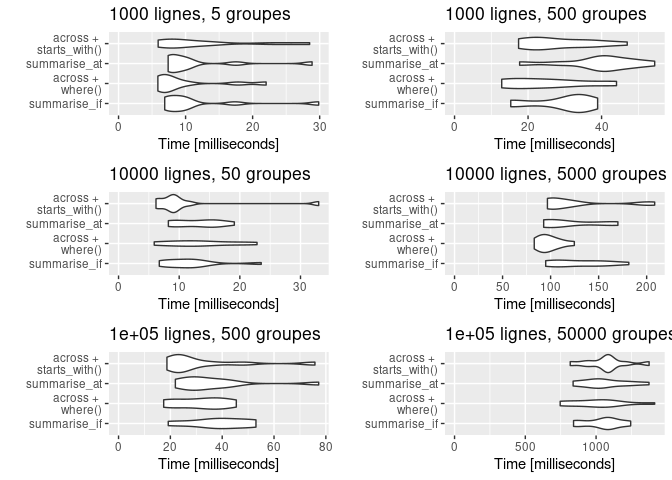
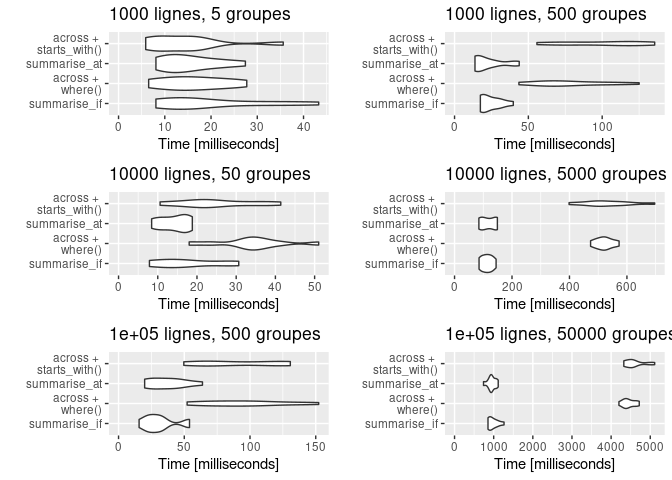

Title: Fonctionnement et performances d'across dans dplyr
Author: Antoine
Date: '2021-06-02'
Category: R
Tags: R, Rstats, dplyr, across, tidyverse
Cover: images/cover_5.png
twitter_image: images/cover_5.png
Summary: Mise à jour de l'évaluation des performances du verbe `across` dans dplyr version 1.0.6


[TOC]

A la sortie de l'été dernier, j'ai réalisé une <a href="https://antoinesir.rbind.io/post/fonctionnement-de-across-dans-dplyr/" target="_blank">note sur mon blog personnel</a> sur un élément important d'une mise à jour majeure de dplyr : `across()`, un nouveau verbe pour réaliser des opérations sur plusieurs colonnes. Dans cette note, on utilisait la version `1.0.2` de `dplyr` et on comparait `across` aux verbes équivalents que cela devait remplacer (fonctions indexées par `_at`, `_if` et `_all`) . On constatait une moins bonne performance d' `across` en termes de temps d'exécution. Cet élément était bien connu des développeurs de RStudio et a été constamment pris en compte dans les différentes mises à jour. On reprend ici cette note en la mettant à jour avec la version `1.0.6` de `dplyr` disponible à ce jour pour voir où se place désormais `across` en termes de temps d'exécution.

Si vous voulez balayer plus largement les différents éléments de la mise à jour de `dplyr`, vous pouvez vous rendre sur <a href="https://www.tidyverse.org/blog/2020/06/dplyr-1-0-0/" target="_blank">le site du tidyverse</a> (en anglais) ou sur <a href="https://thinkr.fr/hey-quoi-de-neuf-dplyr-le-point-sur-la-v1/#La_fonction_de_calcul_avec_conditions_sur_les_variables_across()" target="_blank">cet article du blog de ThinkR</a> (en français) qui en présentent les changements majeurs. 

# `across()`, ça marche comment?  

## Syntaxe de base  

Le verbe `across()` vise à remplacer toutes les fonctions suffixées par `_if`, `_at` et `_all`. Il regroupe ces méthodes dans une seule et permet ainsi de les associer, ce qui n'était pas possible avant. Il s'utilise dans `mutate` et `summarise`. La syntaxe associée à ce verbe est la suivante :   


```r
across(.cols, .fns)
```
 Dans laquelle :  
 - Les colonnes `.cols` peuvent être sélectionnées en utilisant la même syntaxe que pour la méthode `vars()` (nom des variables, `starts_with`, `end_with`, `contains`,...), mais aussi avec des conditions rentrées dans `where()` qui sélectionneront de la même manière que le faisaient les fonctions suffixées par `_if`.  
 - La fonction `.fns` est définie comme auparavant (le nom de la fonction ou sa définition "à la volée" avec `~ my_fun(.)`).  
 

On présente quelques exemples en utilisant la table `penguins` promue par <a href="https://github.com/allisonhorst/palmerpenguins" target="_blank">Allison Horst</a> pour remplacer l'usage de la table iris. Vous pouvez l'obtenir depuis le package `palmerpenguins` sur le CRAN.  

## Sélection avec des conditions  

À partir de cette table, l'instruction visant à sortir la moyenne de toutes les variables numériques s'écrivait auparavant :  


```r
penguins %>% summarise_if(is.numeric, mean, na.rm = TRUE)
## # A tibble: 1 x 5
##   bill_length_mm bill_depth_mm flipper_length_mm body_mass_g  year
##            <dbl>         <dbl>             <dbl>       <dbl> <dbl>
## 1           43.9          17.2              201.       4202. 2008.
```

Elle se réécrit avec `across()` en utilisant `where()` :  


```r
penguins %>% summarise(across(where(is.numeric), mean, na.rm = TRUE))
## # A tibble: 1 x 5
##   bill_length_mm bill_depth_mm flipper_length_mm body_mass_g  year
##            <dbl>         <dbl>             <dbl>       <dbl> <dbl>
## 1           43.9          17.2              201.       4202. 2008.
```

## Sélection à partir du nom  

Si l'on souhaite sélectionner à partir du nom des variables, la nouvelle syntaxe est la suivante :  


```r
# Ancienne version
penguins %>% summarise_at(vars(matches("bill*|flipper*")), mean, na.rm = TRUE)
## # A tibble: 1 x 3
##   bill_length_mm bill_depth_mm flipper_length_mm
##            <dbl>         <dbl>             <dbl>
## 1           43.9          17.2              201.

# Avec across()
penguins %>% summarise(across(matches("bill*|flipper*"), mean, na.rm = TRUE))
## # A tibble: 1 x 3
##   bill_length_mm bill_depth_mm flipper_length_mm
##            <dbl>         <dbl>             <dbl>
## 1           43.9          17.2              201.
```

## Autres propriétés  

On note également qu'on peut combiner dorénavant les sélections sur les types des colonnes et sur leur nom dans une seule instruction `across()`, ce qui n'était pas possible avant. Pour enlever les années des moyennes numériques, on peut par exemple écrire :   


```r
penguins %>% summarise(across(where(is.numeric) & -contains("year"), mean, na.rm = TRUE))
## # A tibble: 1 x 4
##   bill_length_mm bill_depth_mm flipper_length_mm body_mass_g
##            <dbl>         <dbl>             <dbl>       <dbl>
## 1           43.9          17.2              201.       4202.
```

Enfin, le paramètre `.names` de `across()` est également très pratique et permet notamment dans une instruction `mutate()` de créer de nouvelles colonnes nommées à partir des anciennes auxquelles on peut se référer avec `.col`. Par exemple, si je veux créer deux nouvelles colonnes passant les informations sur le bec en pouces mais en conservant les anciennes colonnes, je peux écrire :  


```r
penguins %>% 
  mutate(across(starts_with("bill"), ~ . * 0.04, .names = "pouces_{.col}")) %>% 
  select(contains("bill")) %>% head(5)
## # A tibble: 5 x 4
##   bill_length_mm bill_depth_mm pouces_bill_length_mm pouces_bill_depth_mm
##            <dbl>         <dbl>                 <dbl>                <dbl>
## 1           39.1          18.7                  1.56                0.748
## 2           39.5          17.4                  1.58                0.696
## 3           40.3          18                    1.61                0.72 
## 4           NA            NA                   NA                  NA    
## 5           36.7          19.3                  1.47                0.772
```

# `across()`, ça tourne comment?  
À la sortie de la mise à jour de `dplyr`, il avait été signalé que la méthode `across()` impliquerait peut-être de légères pertes en termes de vitesse d'exécution par rapport aux anciennes méthodes `_at`, `_if` et `_all`. On a mis en évidence ce problème avec la version `1.0.2` de dplyr dans <a href="https://antoinesir.rbind.io/post/fonctionnement-de-across-dans-dplyr/" target="_blank">la première version de cet article</a>. Sur ce même modèle, on va comparer les instructions `_if` et `_at` d'un summarise groupé avec leurs équivalents dans `across()` pour différentes tailles d'échantillons et de groupes.   

## Instructions sur lesquelles on compare les méthodes 
On crée un tibble comportant 4 variables numériques et une variable facteur, et on va comparer la vitesse d'exécution des moyennes de ces variables numériques groupées par modalité de la variable facteur en faisant varier le nombre de lignes du tibble et le nombre de groupes (de modalités distinctes de la variable facteur). Le tibble est créé par exemple ainsi, pour 100 lignes et deux groupes :  

```r
nbrow <- 100
nbgpe <- 2
as_tibble(data.frame(x1 = rnorm(nbrow), x2 =  rnorm(nbrow), 
                     x3 = runif(nbrow), x4 = runif(nbrow),
                     y = as.factor(sample(floor(nbgpe), replace = TRUE))
                               )) %>% 
  arrange(x1) %>% 
  mutate(across(where(is.numeric), ~ round(., 2)))
## # A tibble: 100 x 5
##       x1    x2    x3    x4 y    
##    <dbl> <dbl> <dbl> <dbl> <fct>
##  1 -3.36  0.9   0.32  0.36 2    
##  2 -3.04  0.92  0.61  0.46 2    
##  3 -2.4   1.37  0.32  0.98 2    
##  4 -2.08  1.64  0.87  0.72 2    
##  5 -2.05  1.22  0.62  0.79 2    
##  6 -1.78 -1.28  0.58  0.31 2    
##  7 -1.56  1.19  0.96  0.58 2    
##  8 -1.55 -1.18  0.4   0.85 2    
##  9 -1.47  1.77  0.71  0.21 2    
## 10 -1.29 -0.6   0.68  0.4  2    
## # … with 90 more rows
```


Sur chaque tibble (chaque combinaison du nombre de lignes et de groupes), les différentes instructions testées sont les suivantes :  

```r
# summarise_if  
data %>% group_by(y) %>% summarise_if(is.numeric, mean) 

# across + where()  
data %>% group_by(y) %>% summarise(across(where(is.numeric), mean))  

# summarise_at  
data %>% group_by(y) %>% summarise_at(vars(starts_with("x")), mean) 

# across + starts_with()  
data %>% group_by(y) %>% summarise(across(starts_with("x"), mean))
```

Toutes les instructions font la même chose : une moyenne groupée par `y` des 4 variables numériques. L'idée est de vérifier que l'option `across` n'est pas plus lente que les options `summarise_if` et `summarise_at`. 

## Résultats de la version 1.0.6   

Les résultats du `microbenchmark()` pour les différentes combinaisons de nombres de groupes et de lignes sont présentés dans un graphique qui représente la distribution du temps d’exécution des 10 occurences testées pour chaque méthode :     


<!-- -->

Sur nos exemples, il semblerait qu'`across` ait complètement rattrapé son retard sur ses équivalents `_at` et `_if`. Il semble même légèrement plus performant dans certains cas de figure.  

## Résultats de la version 1.0.0  

Pour illustrer le chemin parcouru, on peut refaire tourner cette même comparaison avec la version `1.0.0` de `dplyr` :  


<!-- -->

On constate bien que dans sa première version, `across` connaissait de bien moins bonnes performances, en particulier sur les dataframes avec beaucoup de lignes et/ou beaucoup de groupes. Les mises à jour successives ont donc bien permis de combler ces problèmes de performance et c'est une excellente nouvelle car au niveau de la syntaxe, nous, on adore!  

C'est tout pour aujourd'hui ! Comme d'habitude vous pouvez retrouver le fichier Rmarkdown ayant servi à générer cette note sur le <a href="https://github.com/Statoscop/notebooks-blog" target="_blank">github de Statoscop</a>.
