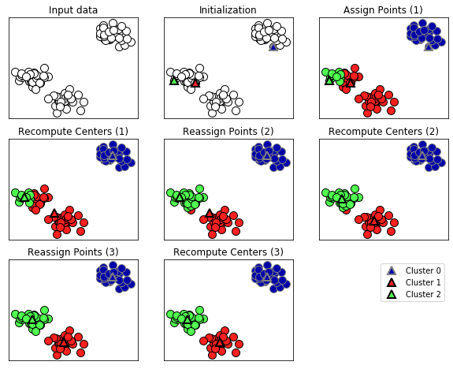

Title: Un gros test
Date: 2021-01-29 10:20
Category: Python 
Tags: pelican, noobies, test
Slug: test-post
Authors: Antoine Sireyjol
Summary: Rien à voir, c'est juste un test


# Titre  de test

Ceci est un article sur Python, qui est super pratique.


```python
%matplotlib inline
import matplotlib.pyplot as plt
plt.style.use('seaborn-whitegrid')
import numpy as np
```


```python
fig = plt.figure()
ax = plt.axes()
x = np.linspace(0, 10, 1000)
ax.plot(x, np.sin(x))
```

    

    

