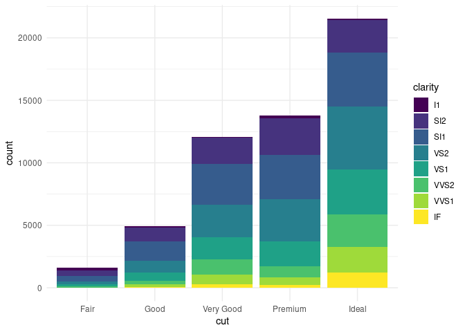
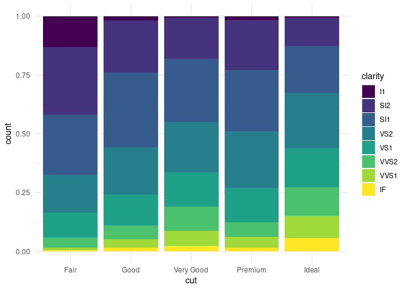
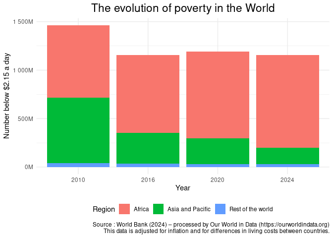
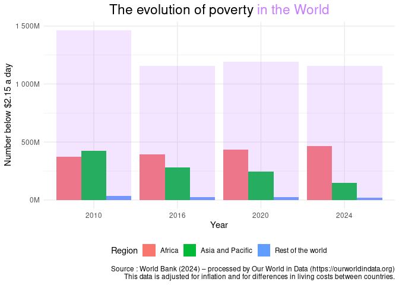
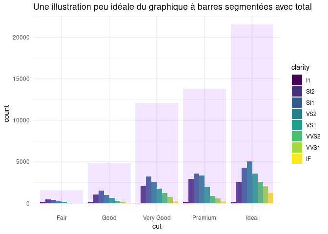

Title: Graphiques et diagrammes à barres empilées : présentation d'une alternative avec R et ggplot2
Author: Antoine
Date: '2025-04-28'
Category: R
Tags: R, ggplot2, dataviz
Cover: images/cover_24.png
twitter_image: images/cover_24.png
Summary: Une alternative pour visualiser des sous-ensembles et leur total sans les empiler

[TOC]


Aujourd'hui nous vous proposons un petit article dataviz avec ggplot2 pour apporter notre modeste contribution à des discussions vues ici et là sur __la pertinence des graphiques à barres empilées__, en anglais __stacked bar charts__. Plus spécifiquement, on se propose de coder en ggplot2 une visualisation vue sur [un article présentant la meilleur alternative aux graphiques empilées](https://www.flerlagetwins.com/2025/04/the-best-alternative-to-stacked-bar.html) (selon son auteur).  

# Déchiffrer un diagramme à barres empilées  


Un graphique à barres empilées permet __d'illustrer l'évolution ou la comparaison d'une mesure globale, tout en la déclinant par des sous-ensembles__. Par exemple, on peut utiliser la base `diamonds` de ggplot2 pour présenter la pureté de la coupe des diamants (variable `clarity`) en fonction de la qualité de leur taille (variable `cut`) : 


```r
library(ggplot2)
diamonds |> 
  ggplot(aes(x = cut, fill = clarity)) +
  # par défaut, geom_bar s'exécute avec position = "stack" :
  geom_bar() + 
  theme_minimal()
```

<!-- -->

Que nous indique ce graphique? Pas grand chose en réalité, si ça n'est que notre base contient d'autant plus de diamants que la qualité de leur taille est bonne. Mais pour déduire la même chose de chaque niveau de pureté de diamants, il faut se livrer à un exercice de concentration intense que ne devrait pas nécessiter une bonne visualisation. À part pour le niveau `IF`, le plus pur, dont ont voit clairement que le nombre augmente avec la qualité de la taille, __il est difficile d'évaluer l'augmentation relative de chaque sous-ensemble, d'autant plus que les effectifs totaux diffèrent__.  

Bien sûr, on peut décider de changer légèrement le type de notre graphique et de représenter plutôt la répartition relative du niveau de pureté des diamants __pour chaque qualité de taille__, en spécifiant le paramètre `position` de geom_bar à `fill` :  


```r
diamonds |> 
  ggplot(aes(x = cut, fill = clarity)) +
  geom_bar(position = "fill") + 
  theme_minimal()
```

<!-- -->

À part pour les niveaux extrêmes de pureté (`I1` et `IF`), l'évolution de la répartition pour chaque catégorie de diamants demeure assez obscur, et on a en plus perdu l'information sur le nombre de diamants totaux que chaque catégorie représente!  
Ce problème, soulevé par nombre de spécialistes de la dataviz, et notamment [Yan Holtz dans un article récent](https://www.data-to-viz.com/caveat/stacking.html), a poussé certains à chercher des alternatives. L'idée est de pouvoir __présenter clairement à la fois l'évolution d'un total et de ses sous-ensembles__. 

> 👋 Nous c'est Antoine et Louis de Statoscop, une coopérative de statisticiens / data scientists.
> Vous voulez en savoir plus sur ce que l'on fait?
<div class = "d-flex justify-content-center mt-4">
   <a href="https://statoscop.fr" target=_blank class="btn btn-primary btn-custom text-uppercase" type="button">Visiter notre site</a>
   <a href="https://statoscop.fr/contact" target=_blank class="btn btn-primary btn-custom text-uppercase" type="button">Nous contacter</a>
</div>
<br>    

# Segmenter plutôt qu'empiler vos barres avec ggplot2

Nous proposons ici [d'appliquer la méthode présentée par Kevin Flerlage](https://www.flerlagetwins.com/2025/04/the-best-alternative-to-stacked-bar.html). La solution qu'il propose avec l'outil Tableau nous semble élégante et __nous montrons ici comment la mettre en oeuvre avec__ `ggplot2`.  

## Visualiser l'évolution de la pauvreté dans le monde par régions  

On s'appuie ici sur des données de [World In Data](https://ourworldindata.org) en 2010, 2016, 2020 et 2024. On choisit de regarder l'évolution du nombre de personnes sous le seuil de 2.15$ par jour, déclinée par grande région du monde.  

Avec `ggplot2` et `geom_col`, on peut facilement proposer une représentation avec un graphique à barres empilées :  


```r
library(scales) # pour scale du y-axis
library(ggtext) # pour mise en forme du titre

data_wid_country |> 
  ggplot() + 
  geom_col(aes(x = Year, y = `Number below $2.15 a day`,
               fill = Region)) + 
  scale_y_continuous(labels = label_number(scale = 1e-6, suffix = "M")) + 
  labs(title = "The evolution of poverty in the World",
       caption = "Source : World Bank (2024) – processed by Our World in Data (https://ourworldindata.org)
       This data is adjusted for inflation and for differences in living costs between countries.") + 
  theme_minimal() + 
  theme(plot.title = element_markdown(size = 17,
                                      hjust = 0.5),
        legend.position = "bottom") 
```

<!-- -->

Ce graphique nous permet de voir une baisse du nombre de personnes pauvres entre 2010 et 2016 puis une stagnation de cet indicateur entre 2016 et 2024. Il __ne nous permet cependant pas d'évaluer précisément l'évolution au sein de chaque région du monde__. 

## Le graphique à barres segmentées avec total 

Nous traduisons ici le terme proposé par Kevin Flerlage. L'idée est la suivante : on va juxtaposer plutôt qu'empiler les différents sous-ensembles. On va pour cela utiliser le paramètre `position = "dodge"` de `geom_col`.  

Le problème à ce stade est bien sûr __qu'on ne dispose plus d'estimation du total__. Il s'agit donc d'ajouter __une barre totale qui englobe les barres des sous-ensembles__, avec une transparence pour permettre une bonne visibilité. C'est un jeu d'enfant avec `ggplot2` puisqu'il s'agit simplement d'ajouter un `geom_col` et de lui choisir une couleur avec `fill` et un niveau de transparence avec `alpha`.  

Si on considère qu'il n'est pas assez explicite que la barre ajoutée correspond au total, on peut s'en sortir en ajoutant dans le titre la même couleur que celle de la barre transparente. Le résultat est le suivant :  


```r
data_wid_country |> 
  ggplot() + 
  geom_col(aes(x = Year, y = `Number below $2.15 a day`,
               fill = Region),
           # changement de la position
           position = "dodge") + 
  # ajout d'un geom_col
  geom_col(aes(x = Year, y = `Number below $2.15 a day`),
           alpha = 0.2, fill = "#C77CFF") + 
  scale_y_continuous(labels = label_number(scale = 1e-6, suffix = "M")) + 
  labs(title = "The evolution of poverty <span style='color:#C77CFF;'>in the World</span>",
        caption = "Source : World Bank (2024) – processed by Our World in Data (https://ourworldindata.org)
       This data is adjusted for inflation and for differences in living costs between countries.") + 
  theme_minimal() + 
  theme(plot.title = element_markdown(size = 17,
                                      hjust=0.5),
        legend.position = "bottom") 
```

<!-- -->

On constate en effet que la lecture nous semble plus explicite : au niveau mondial sur notre période de temps, le nombre de pauvres a baissé. Cela se traduit cependant par deux trajectoires différentes : une baisse très marquée dans la région Asie-Pacifique et un hausse en Afrique.

# Choisir le graphique adapté à son problème   

Cette proposition d'alternatives aux graphiques à barres empilées nous semble intéressante, notamment dans ce cas spécifique ou __le total représente la somme de ses sous-ensembles__. Dans le cas où on voudrait par exemple __représenter une moyenne totale et la comparer à des moyennes de sous-ensembles__, on préconiserait sans doute de présenter celle-ci avec une forme différente, comme un point ou un losange. Le code présenté ci-dessus peut-être utilisé de la même manière en changeant le `geom_col` par ce qui vous semble approprié.  

Enfin, lorsque votre problématique contient de nombreux sous-ensembles, __ce choix n'est probablement pas adapté car le total peut avoir une échelle trop différente de chacun des sous-ensembles__. C'est le cas par exemple pour la problématique des diamants que je présentais en début de post, et pour laquelle le graphique à barres segmentées n'aurait pas donné un résultat satisfaisant :  

<!-- -->

Pour autant, __on ne vous recommande pas non plus de faire un graphique avec deux axes verticaux__. Cela pourra faire l'objet d'une prochaine note de blog! 

C'est tout pour aujourd'hui! On espère que cette note vous débloquera dans le choix de votre prochaine représentation graphique. Si vous avez besoin de [conseils en programmation pour la statistique et la data science](https://statoscop.fr), n'hésitez pas à nous contacter sur notre site, [BlueSky](https://bsky.app/profile/statoscop.fr) ou [Linkedin](https://www.linkedin.com/company/statoscop).


<div class = "d-flex justify-content-center mt-4">
   <a href="https://statoscop.fr" target=_blank class="btn btn-primary btn-custom text-uppercase" type="button">Visiter notre site</a>
   <a href="https://statoscop.fr/contact" target=_blank class="btn btn-primary btn-custom text-uppercase" type="button">Nous contacter</a>
</div>
<br>  