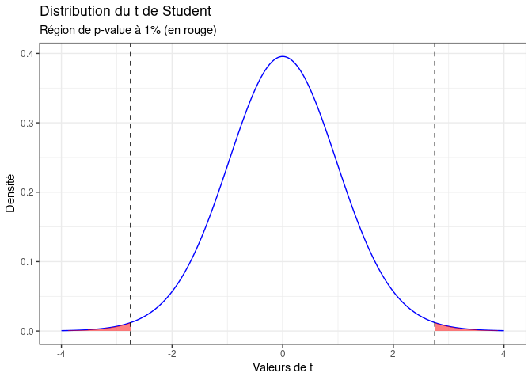

Title: Comprendre et interpréter les p-values
Author: Antoine
Date: '2024-07-09'
Category: Stats & ML
Tags: statistiques, p-values, R, tests
Cover: images/cover_18.png
twitter_image: images/cover_18.png
Summary: Petite présentation intuitive des p-values et de leur utilisation dans nos modèles statistiques.

[TOC]  

Aujourd'hui c'est à un grand classique de la statistique que l'on s'attaque : la __p-value, ou valeur p__. Fondamentale dans l'analyse des résultats de la recherche scientifique, elle est pourtant __souvent mal interprétée__. C'est sur elle que l'on s'appuie pour __confirmer ou infirmer une hypothèse__ et juger de la __significativé de nos résultats__. Mais qu'est-ce que cela implique et comment bien appréhender ce qu'elle permet (et surtout ce qu'elle ne permet pas) de conclure? On essaye de voir ça ensemble, de la manière la plus intuitive possible!  

# Les p-values et les tests statistiques  

Pour comprendre les p-values, il faut aborder la notion de __tests statistiques__. Ils permettent de tester une __Hypothèse nulle `H0`__ contre une __hypothèse alternative `H1`__. Par exemple, prenons le cas d'une régression linéaire où on cherche à estimer des coefficients $\beta_i$ décrivant le lien entre une variable d'intérêt  $Y$ et des variables explicatives $X_i$ :  

$Y = \beta_0 + \beta_1 X_1 + \beta_2 X_2 + \beta_3 X_3 + \dots$

Pour chaque coefficient estimé $\beta_i$, on utilise le __test t de Student__ qui nous permet de tester les hypothèses :  
- `H0` : $\beta_i  = 0$  
- `H1` : $\beta_i \neq 0$

Le principe du test est le suivant : on va __partir du principe que H0 est vrai__ et on va voir __quelle est la chance d'observer notre résultat dans ce monde théorique__. Ce test statistique va ainsi nous donner la __distribution possible des résultats que l'on pourrait obtenir à partir de différents échantillons si `H0` était vraie__. Selon où l'on se situe dans cette distribution, on va pouvoir juger de la __vraisemblance de cette hypothèse H0__, en fonction d'un __seuil alpha que l'on peut faire varier__. En fonction de la valeur de `t` obtenue avec notre échantillon, on peut décider de rejeter ou non l'hypothèse `H0` :  

<!-- -->

Sur le graphique ci-dessus, la zone rouge représente __5% de l'aire de la courbe de densité__. Si la valeur obtenue par notre test est dans cette zone, on sait que __cela représenterait 5% ou moins des résultats possibles que l'on aurait obtenus si `H0` était vraie__. On peut donc en déduire que __la nullité du coefficient est peu probable__. 

Bien sûr, si on modifie le seuil alpha dans un sens plus restrictif, mettant le seuil de significativité à 1%, cela va restreindre la zone rouge de notre graphique. Il faudra alors obtenir __une valeur `t` encore plus extrême pour rejeter `H0`__ : 

<!-- -->

Ainsi, lorsqu'on fait tourner un modèle de régression sur notre logiciel de statistiques favori et que l'on obtient une p-value, il s'agit du __seuil alpha de notre hypothèse `H0`__ qui doit nous permettre de décider de la rejeter ou non. On va donc l'utiliser pour décider de la __significativité de ce coefficient__. Si l'on devait synthétiser ce que veut dire la p-value en une phrase, cela donnerait :   

> Si la vraie valeur du coefficient était 0 et que 
> j'avais fait tourner ce modèle sur 100 échantillons 
> différents, j'aurais obtenu un résultat au moins 
> aussi extrême dans p cas.   

Ainsi, __plus p est faible, plus on peut écarter l'hypothèse que le coefficient estimé soit nul__.  

# Interprétation des p-values

Il faut bien comprendre que la p-value et la __significativité du coefficient__ qui en découle ne portent que sur la question de savoir si ce coefficient est ou non différent de zéro. Cela n'indique pas si le résultat trouvé a une importance particulière. Un coefficient peut très bien être __significatif statistiquement__ (donc probablement différent de zéro) mais __en pratique insignifiant__. Il faut donc le confronter à l'expertise pratique de la question de recherche étudiée.  

Une faible p-value n'est pas non plus le signe d'une __estimation précise__. Pour juger de cet aspect, il est important de regarder __les intervalles de confiance__. Un coefficient peut très bien être __significativement différent de zéro mais avoir un intervalle de confiance très large__, ce qui est très important à considérer en fonction des implications pratiques de votre recherche. On sait seulement que si par exemple __l'intervalle de confiance à 95% ne contient pas 0__ (ou 1 si on estime des [odds-ratios](https://blog.statoscop.fr/risques-relatifs-et-odds-ratios-comment-les-interpreter-et-les-comparer.html)), le __coefficient estimé est significatif à au moins 5%__. 
  
De plus, un résultat peut être __non significatif en raison d'une mauvaise calibration du modèle__ : un échantillon trop peu important, de trop nombreuses variables explicatives, etc... C'est notamment pour cette raison qu'il __ne faut pas directement interpréter un coefficient non significatif comme un absence d'effet__. C'est plutôt une absence de preuve d'effet. Oui, c'est moins facile à rédiger, mais cela rend plus justice à la complexité des statistiques inférentielles.    
  
En général, le consensus scientifique fixe le __seuil de significativité à 5%__. Bien sûr, c'est forcément au moins partiellement arbitraire et cela pose question : on écarterait un résultat avec une p-value à 5,1% mais on afficherait fièrement celui avec une p-value à 4,9%?    
  
Il est ainsi tentant pour les chercheurs de construire leur modèle en fonction de la p-value recherchée, et non de la question de recherche affichée, ce qui est complètement contre-productif. D'autant que la nature de la p-value fait que __si l'on teste un nombre très important de fois, on finira bien par trouver des résultats significatifs__, mais uniquement du fait du hasard. Cette mauvaise pratique, volontaire ou non, est bien identifiée et se nomme le [p-hacking](https://en.wikipedia.org/wiki/Data_dredging). La bonne manière de se prémunir de cet écueil est de __définir la question de recherche et les modèles statistiques en amont de la collecte de données__ et de calibrer l'échantillon en fonction de ceux-ci. Il faut ensuite tâcher de ne pas s'écarter de ces axes de recherche...même si on n'obtient pas les p-values qu'on espérait!  

# Conclusion   

La p-value, ça n'est donc pas du tout la _probabilité que le coefficient soit incorrect_ ! Dans le cas d'une régression, c'est un indicateur de la vraisemblance que celui-ci soit égal à zéro. Mais __un coefficient significatif peut aussi avoir une estimation très imprécise, ou une valeur insignifiante__. Il est donc fondamental d'affiner son diagnostic, avec par exemple les intervalles de confiance, et surtout l'interprétation de quelqu'un qui comprend les implications pratiques d'un coefficient!  

C'est tout pour aujourd'hui! N'hésitez pas à [visiter notre site (qui a fait peau neuve, vous avez remarqué?)](https://www.statoscop.fr) et à nous suivre sur [Twitter](https://twitter.com/stato_scop) et [Linkedin](https://www.linkedin.com/company/statoscop). Pour retrouver le code ayant servi à générer cette note, vous pouvez vous rendre sur le [github de Statoscop](https://github.com/Statoscop/notebooks-blog).  
