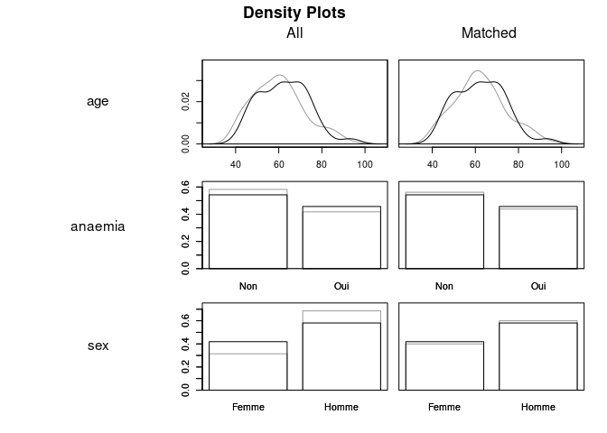

Title: Appariement par score de propension (PSM) : mise en oeuvre avec R et discussions méthodologiques
Author: Antoine
Date: '2025-02-04'
Slug: appariement-score-propension
Category: R, Stats & ML
Tags: R, Rstats, data science, statistiques
Cover: images/cover_21.png
Summary: Implications théoriques des méthodes d'appariement par score de propension et implémentation avec le package R `MatchIt`.


[TOC]  


Pour évaluer un effet causal, comme par exemple les effets d'un médicament sur des patients, on a besoin de ce que l'on appelle un __essai clinique randomisé__. Le principe est le suivant : on prend un certain nombre de patients (à déterminer en fonction de l'effet minimum attendu, mais c'est un autre sujet) et on les sépare aléatoirement en deux groupes : __un groupe traitement__ qui prend le médicament et __un groupe contrôle__ qui en général prend un placebo.  
Comme on a décidé de manière complètement aléatoire l'assignation à l'un ou l'autre groupe, on sait que ces deux groupes auront en moyenne des caractéristiques identiques (merci la loi faible des grands nombres!). Cela nous permet de conclure que les différences qui seraient observées entre les deux groupes (meilleur rétablissement, prise de poids, selon ce qu'on cherche à observer...) __sont imputables au traitement et non à une spécificité d'un des groupes par rapport à l'autre__.  

L'essai clinique randomisé, c'est donc l'idéal pour montrer un effet causal et c'est d'ailleurs par là qu'il faut passer si vous souhaitez homologuer un nouveau médicament. Mais c'est également coûteux et difficile à réaliser. C'est pourquoi on cherche de plus en plus à essayer __d'imiter les conditions d'un essai clinique randomisé à partir de données observationnelles__. Pour cette note de blog, on va vous présenter une ces méthodes : le __propensity score matching (PSM), ou appariement par score de propension__.  


# Principes du Propensity Score Matching

L'appariement par score de propension vise à __recréer les conditions d'un essai clinique à partir de données observationnelles__. On a ainsi un ensemble de données avec par exemple un certain nombre de patients qui ont pris un traitement (le _groupe traitement_) et d'autres qui ne l'ont pas pris (le _groupe contrôle_). Problème : ces population qui n'ont pas été séparées de manière aléatoire __peuvent être très différentes__ et il n'est pas possible en l'état de conclure qu'une différence entre elles soit imputable au traitement en question. Il faut donc recréer deux groupes de contrôle et de traitement qui puissent être comparables.    

## Calcul du score de propension  

La première étape est de __calculer le score de propension__. Il est nécessaire en premier lieu __d'identifier les variables observables__ sur lesquelles on souhaiterait rééquilibrer les deux groupes. Il n'y a pas de méthode magique pour choisir ces variables : il faut que ce soit la connaissance technique du cas qui guide votre choix. L'idée est d'identifier les variables dont vous imaginez qu'elles peuvent être __déséquilibrées entre vos deux groupes__ pour différentes raisons (par exemple, le traitement A est plus souvent donné aux femmes donc je sais qu'il y aura plus de femmes dans ce groupe que dans un autre). Il faut aussi bien sûr contrôler par les variables dont on sait qu'elles peuvent avoir __un impact sur le résultat indépendemment de l'efficacité du médicament__ (l'âge impacte souvent la probabilité de guérison par exemple).  

Une fois ces variables identifiées, il ne vous reste plus qu'à faire __sur l'ensemble de vos données un modèle de régression logistique.__ Par exemple, si votre groupe traitement prend un médicament A et le reste du groupe ne prend pas ce médicament, votre variable `Y` sera l'indicatrice _Prend le médicament A_ et vos variables $X_i$ les variables sur lesquelles vous souhaitez contrôler (sexe, âge, etc...). La formule est la suivante :  

$\log \left( \frac{P(Y=1)}{1 - P(Y=1)} \right) = \beta_0 + \beta_1 X_1 + \beta_2 X_2 + \beta_3 X_3 + \dots$


## Appariement de vos données  

La mise en oeuvre de cette régression logistique nous permet __d'obtenir un score de propension__. Celui-ci représente pour chaque individu la probabilité prédite qu'il appartienne au groupe traitement. Ce score de propension peut-être utilisé dans différentes méthodes (IPTW, variable d'ajustement dans la modèle...). Pour le PSM, nous l'utilisons pour __apparier les données__.  

En effet, pour chaque observation du groupe traité, l'idée est de lui attribuer une (ou plusieurs, selon vos données) observation(s) du groupe contrôle, ayant __un score de propension le plus proche possible__, donc des caractéristiques semblables. Différentes méthodes d'appariement existent, la plus courante étant celle du plus proche voisin.  

Une fois que chaque observation du groupe traitement s'est vue attribuer son plus proche voisin du groupe contrôle, on écarte les données qui n'ont pas été appariées. La première chose à faire est bien sûr __d'évaluer la qualité de l'appariement__ en vérifiant la répartition des variables de contrôle entre les deux groupes. Puis, nous allons réaliser nos analyses comme si nous étions dans le cas d'un essai clinique randomisé, ou presque...
  

> 👋 Nous c'est Antoine et Louis de Statoscop, une coopérative de statisticiens / data scientists.
> Vous voulez en savoir plus sur ce que l'on fait?
<div class = "d-flex justify-content-center mt-4">
   <a href="https://statoscop.fr" target=_blank class="btn btn-primary btn-custom text-uppercase" type="button">Visiter notre site</a>
   <a href="https://statoscop.fr/contact" target=_blank class="btn btn-primary btn-custom text-uppercase" type="button">Nous contacter</a>
</div>
<br>


# Mise en oeuvre de l'appariement par score de propension avec R  

Les méthodes utilisant des scores de propension, et en particulier l'appariement par score de propension, sont très bien prises en charge avec R. Nous vous proposons ici d'utiliser le package R `MatchIt` sur des [données cliniques librement accessibles](https://archive.ics.uci.edu/dataset/519/heart+failure+clinical+records). Il s'agit de patients hospitalisés pour une insuffisance cardiaque.  

## Description des données et de notre problématique  


Nos données représentent 299 patients.  Parmi eux, la prévalence de cas d'hypertension artérielle (HTA) est la suivante :  


Table: Présence de diabètes

|high_blood_pressure |   n|
|:-------------------|---:|
|Non                 | 194|
|Oui                 | 105|

Il y a 13 variables disponibles :  


```
##  [1] "age"                      "anaemia"                 
##  [3] "creatinine_phosphokinase" "diabetes"                
##  [5] "ejection_fraction"        "high_blood_pressure"     
##  [7] "platelets"                "serum_creatinine"        
##  [9] "serum_sodium"             "sex"                     
## [11] "smoking"                  "time"                    
## [13] "death_event"
```

On cherche ici à __évaluer l'impact de l'HTA sur la probabilité de décéder des suites d'une insuffisance cardiaque__. Notre __variable d'intérêt__ est donc `death_event`. Notre _traitement_ (ici on ne regarde pas l'effet d'un traitement mais d'une caractéristique des patients, cependant on va continuer à utiliser cette terminologie) est ici le fait d'avoir une HTA. Le croisement de ces deux variables donne le résultat suivant :  


Table: HTA et décès

|high_blood_pressure | Effectifs| Part de décès|
|:-------------------|---------:|-------------:|
|Non                 |       194|          0.29|
|Oui                 |       105|          0.37|

Ici à première vue on trouve une proportion plus importante de décès parmi les patients ayant une HTA (37% contre 29% pour les autres). Mais bien sûr, il n'est pas encore possible de __savoir si cela est dû à l'HTA en soi ou à d'autres caractéristiques__ des patients souffrant de ce problème.

## Calcul du score de propension et appariement des patients  


La fonction `matchit` du package R `MatchIt` nous permet de __mettre directement en oeuvre le calcul du score de propension et l'appariement__. On commence par sélectionner les variables par lesquelles il nous semble important de contrôler : ici nous allons prendre l'ensemble des variables cliniques dont nous disposons. Il faut alors __retirer les valeurs manquantes__ pour ensuite obtenir deux groupes de patients avec et sans HTA ayant des caractéristiques semblables par ailleurs. La fonction s'écrit ainsi :  


```r
library(MatchIt)
m.out1 <- matchit(high_blood_pressure ~ age + sex + anaemia + creatinine_phosphokinase + diabetes + 
                    platelets + serum_creatinine + serum_sodium + smoking, 
                  data = data_ps,
                  method = "nearest",
                  distance = "glm",
                  estimand = "ATT")
```

Ici on choisit le paramétrage par défaut `method = "nearest"` qui apparie à chaque observation du __groupe traité__ (les patients ayant une HTA) l'observation du __groupe contrôle__ ayant le score de propension le plus proche possible.
Le paramètre `method = "ATT"` permet d'évaluer un __effet du traitement sur les traités__ et non sur la population globale. Enfin, on définit le modèle (ici logistique avec avec `distance = "glm"`) pour le calcul du score de propension. Si vous avez un doute sur la méthode à utiliser, [reportez-vous à la documentation du package MatchIT](https://cran.r-project.org/web/packages/MatchIt/vignettes/MatchIt.html).

## Évaluation de la qualité de l'appariement

Encore une fois, la librairie `MatchIt` nous mâche directement le travail en nous permettant de comparer facilement la __répartition de nos patients avant et après appariement__ avec `summary()`. La __répartition avant l'appariement__ est la suivante :  


```r
output_matching <- summary(m.out1)

# on affiche seulemet l'élément `sum.all` de la sortie
output_matching$sum.all |> 
  knitr::kable(digits = 2)
```


|                         | Means Treated| Means Control| Std. Mean Diff.| Var. Ratio| eCDF Mean| eCDF Max| Std. Pair Dist.|
|:------------------------|-------------:|-------------:|---------------:|----------:|---------:|--------:|---------------:|
|distance                 |          0.37|          0.34|            0.36|       1.01|      0.11|     0.23|              NA|
|age                      |         62.34|         60.02|            0.20|       0.91|      0.06|     0.13|              NA|
|sexFemme                 |          0.42|          0.31|            0.21|         NA|      0.10|     0.10|              NA|
|sexHomme                 |          0.58|          0.69|           -0.21|         NA|      0.10|     0.10|              NA|
|anaemiaNon               |          0.54|          0.58|           -0.08|         NA|      0.04|     0.04|              NA|
|anaemiaOui               |          0.46|          0.42|            0.08|         NA|      0.04|     0.04|              NA|
|creatinine_phosphokinase |        488.90|        632.14|           -0.16|       0.73|      0.05|     0.11|              NA|
|diabetesNon              |          0.59|          0.58|            0.03|         NA|      0.01|     0.01|              NA|
|diabetesOui              |          0.41|          0.42|           -0.03|         NA|      0.01|     0.01|              NA|
|platelets                |     269989.18|     259769.00|            0.12|       0.66|      0.04|     0.10|              NA|
|serum_creatinine         |          1.39|          1.40|           -0.01|       1.99|      0.03|     0.13|              NA|
|serum_sodium             |        136.85|        136.51|            0.08|       0.82|      0.01|     0.05|              NA|
|smokingNon               |          0.71|          0.66|            0.12|         NA|      0.05|     0.05|              NA|
|smokingOui               |          0.29|          0.34|           -0.12|         NA|      0.05|     0.05|              NA|


On constate ainsi que les personnes souffrant d'hyper tension artérielle sont souvent plus âgées que les autres. Ce sont également plus souvent des femmes, et plus souvent des personnes atteintes d'anémie. Observons maintenant si notre appariement a permis d'équilibrer nos deux groupes sur ces variables et sur les autres :  


```r
# on affiche seulement l'élément `sum.matched` de la sortie
output_matching$sum.matched |> 
  knitr::kable(digits = 2)
```


|                         | Means Treated| Means Control| Std. Mean Diff.| Var. Ratio| eCDF Mean| eCDF Max| Std. Pair Dist.|
|:------------------------|-------------:|-------------:|---------------:|----------:|---------:|--------:|---------------:|
|distance                 |          0.37|          0.37|            0.04|       1.10|      0.01|     0.10|            0.05|
|age                      |         62.34|         62.36|            0.00|       0.93|      0.03|     0.07|            0.89|
|sexFemme                 |          0.42|          0.40|            0.04|         NA|      0.02|     0.02|            0.54|
|sexHomme                 |          0.58|          0.60|           -0.04|         NA|      0.02|     0.02|            0.54|
|anaemiaNon               |          0.54|          0.56|           -0.04|         NA|      0.02|     0.02|            0.96|
|anaemiaOui               |          0.46|          0.44|            0.04|         NA|      0.02|     0.02|            0.96|
|creatinine_phosphokinase |        488.90|        481.78|            0.01|       0.89|      0.02|     0.07|            0.46|
|diabetesNon              |          0.59|          0.63|           -0.08|         NA|      0.04|     0.04|            1.01|
|diabetesOui              |          0.41|          0.37|            0.08|         NA|      0.04|     0.04|            1.01|
|platelets                |     269989.18|     264619.41|            0.06|       0.87|      0.03|     0.10|            1.02|
|serum_creatinine         |          1.39|          1.43|           -0.03|       2.09|      0.04|     0.18|            0.66|
|serum_sodium             |        136.85|        136.60|            0.06|       0.88|      0.01|     0.05|            1.07|
|smokingNon               |          0.71|          0.74|           -0.06|         NA|      0.03|     0.03|            0.74|
|smokingOui               |          0.29|          0.26|            0.06|         NA|      0.03|     0.03|            0.74|
On constate que la plupart des variables sont maintenant plus équilibrées entre les deux groupes. Au global, la variable `distance` montre la grande proximité du score de propension entre les deux groupes. On peut également mettre en évidence l'effet de l'appariement visuellement sur quelques unes des variables avec la fonction `plot` :  


```r
plot(m.out1, type = "density", interactive = FALSE,
     which.xs = ~ age + anaemia + sex)
```

<!-- -->

## Mesure des effets causaux à partir de la population appariée 

Une fois convaincus de la qualité de l'appariement, on peut mettre en oeuvre notre modèle statistique __en tenant compte pour le calcul des estimateurs du fait que nous manipulons des observations appariées__. Différentes méthodes sont possibles en fonction de la variable d'intérêt, du type d'appariement réalisé, etc. En cas de doute, vous pouvez vous reporter [à la vignette consacrée à l'estimation des effets du package `MatchIt`](https://kosukeimai.github.io/MatchIt/articles/estimating-effects.html#modeling-the-outcome).  

Dans notre exemple simple, nous allons tout d'abord extraire les données appariées avec `match_data` et calibrer un modèle linéaire généralisé. Nous __pondérons avec les poids issus de l'appariement__. S'ils sont tous égaux à 1 (c'est le cas pour nous) cela n'est pas nécessaire. Toutefois, cela reste une bonne habitude en cas d'appariement utilisant des poids différents. Il est possible également de __contrôler notre régression logistique par les variables ayant servi à l'appariement, ou directement par le score de propension__. Nous choisissons ici de ne pas le faire en raison de la bonne qualité de l'appariement. 

Enfin, on utilise le package `marginaleffects` pour estimer l'__effet moyen sur les traités (ATT)__ en tenant compte l'appariement.   


```r
data_matched <- match_data(m.out1)

fit <- glm(death_event ~ high_blood_pressure,
          data = data_matched,
          family = binomial,
          weights = weights)

results <- marginaleffects::avg_comparisons(fit,
                                            vcov = ~subclass,
                                            newdata = subset(high_blood_pressure == "Oui"))


print(results) |> 
  knitr::kable(digits=2)
```


|term                |contrast  | estimate| std.error| statistic| p.value| s.value| conf.low| conf.high| predicted_lo| predicted_hi| predicted|
|:-------------------|:---------|--------:|---------:|---------:|-------:|-------:|--------:|---------:|------------:|------------:|---------:|
|high_blood_pressure |Oui - Non |     0.05|      0.06|      0.76|    0.45|    1.16|    -0.08|      0.17|         0.32|         0.37|      0.37|

L'estimateur représente la __différence de proportions de décès__ entre le groupe traité (ceux avec HTA) et le groupe contrôle (les autres). Elle est ici de 0.05, soit 5 points de pourcentage. En effet, les variables `predicted_lo` et `predicted_hi` indiquent que lorsqu'on apparie, la part de décès dans le groupe contrôle monte à 32% (contre 29% dans l'ensemble des patients n'ayant pas de tension artérielle), alors qu'elle est de 37% dans le groupe traité. De fait, cette différence n'est pas significative, puisque la p-value est de 0.45 ([un autre de nos articles explique ce qu'est une p-value](https://blog.statoscop.fr/comprendre-et-interpreter-les-p-values.html)). Bien sûr, cela ne signifie pas forcément que cet effet n'existe pas, mais en tout cas on ne dispose pas dans nos données de suffisament d'observations pour affirmer ici que l'HTA augmente signficativement la probabilité de décès.

# Forces et limites des méthodes avec score de propension   

De nombreuses questions se posent autour des méthodes de score de propension. La première est sans doute son avantage réel ou supposé par rapport à un modèle multivarié classique. Il est vrai cependant que cette méthode a l'avantage de capter dans une seule variable un ensemble de dimensions observables par lesquelles on souhaite contrôler notre analyse. Mais le fait, dans le cas de l'appariement, de se passer d'une partie des données pose question. Cela permet cependant de calculer __un effet moyen sur les traités (ATT)__ et de ne pas trop biaiser l'effet avec des observations qui auraient des caractéristiques très éloignées de la population traitée. De plus, la méthode de pondération par inverse de probabilité de traitement (IPTW) permet d'utiliser le score de propension sans écarter de données, et il est également possible d'estimer un ATT.  

La plus grosse limite de cette méthode est sans doute le fait qu'elle pourrait faire oublier que nos groupes de traitement et de contrôle sont comparables __uniquement sur des caractéristiques observables__. Il n'est donc pas à exclure que des biais de sélection non observables polluent notre analyse, là où un essai clinique randomisé calibré correctement met normalement à l'abri de ce problème. Il est donc fondamental de garder constamment cet écueil en tête pour essayer d'anticiper les possibles défauts de nos analyses.  

C'est tout pour aujourd'hui! Si vous cherchez des [statisticiens pour vos études cliniques n'hésitez pas à visiter notre site](https://www.statoscop.fr) et à nous suivre sur [Twitter](https://twitter.com/stato_scop) et [Linkedin](https://www.linkedin.com/company/statoscop). Pour retrouver le code ayant servi à générer cette note, vous pouvez vous rendre sur le [github de Statoscop](https://github.com/Statoscop/notebooks-blog).  


<div class = "d-flex justify-content-center mt-4">
   <a href="https://statoscop.fr" target=_blank class="btn btn-primary btn-custom text-uppercase" type="button">Visiter notre site</a>
   <a href="https://statoscop.fr/contact" target=_blank class="btn btn-primary btn-custom text-uppercase" type="button">Nous contacter</a>
</div>