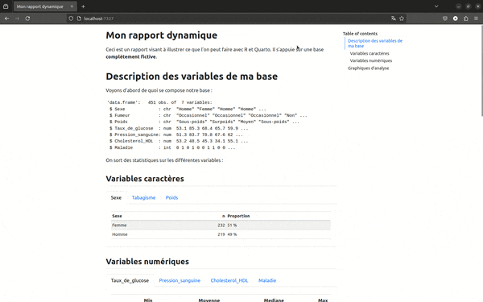
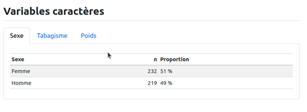
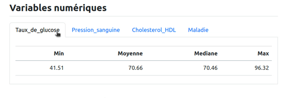
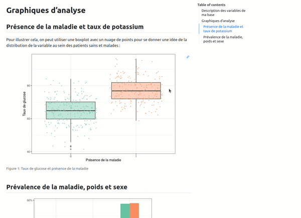
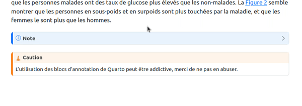

Title: Passer de RMarkdown à Quarto pour vos rapports statistiques  
Author: Antoine
Date: '2024-12-12'
Slug: quarto-rmarkdown
Category: R, Stats & ML
Tags: quarto, rmarkdown, rapport
Cover: images/cover_20.png
Summary: Petit exemple pour vous accompagner dans la transition de RMarkdown vers Quarto, et pourquoi ça va rendre vos rapports encore plus ergonomiques!

[TOC]

[RMarkdown](https://rmarkdown.rstudio.com/) est un outil de génération de rapports qui permet de __communiquer des résultats d'analyse de manière efficace, ergonomique et automatisée__. Nous l'utilisions de manière quasi-quotidienne, mais force est de constater l'émergence irrémédiable de [Quarto](https://quarto.org/). Du coup, on a fini par s'y mettre. Et en effet, Quarto permet non seulement de reproduire le type de rapports que l'on obtenait avec RMarkdown, mais il offre aussi __encore plus de possibilités!__ C'est pour cela que nous vous présentons ici quelques unes de ses fonctionnalités et 2/3 choses à ne pas rater pour l'adopter sans peine.  

Dans cet article nous allons suivre la création d'un rapport fictif, qui repose sur des données complètement inventées. L'idée est d'étudier la prévalence d'une maladie en fonction de différentes variables. 

# Configuration de Quarto  

Pour lancer votre premier rapport, vous pouvez comme pour RMarkdown le créer directement depuis RStudio avec `File -> New file -> Quarto document`. Je préfère personnellement décocher l'option `Use visual markdown editor` qui propose une édition qui met directement en forme la partie Markdown, mais vous pouvez de toute façon passer de l'un à l'autre en cliquant sur `Source` ou `Visual` en haut de de votre écran d'édition.  

La première chose à paramétrer est votre en-tête YAML qui donne les paramétrages globaux de votre document. Voici le mien :  

```MD
---
title: "Mon rapport dynamique"
format: 
  html:
    self-contained: true
    toc: true
    smooth-scroll: true
execute:
  echo: false
--- 

```

Comme pour RMarkdown, on y renseigne le titre et les formats de sortie, ici html. On remarque le paramètre `self-contained: true` __qui est fondamental__ : en effet, les sorties html de Quarto nécessitent de charger beaucoup de classes CSS et de fonctions javascript. Par défaut, tous ces éléments sont stockés dans un dossier `nom_de_votre_fichier_files`. Cela permet par exemple de __ne le charger qu'une fois__ si vous avez plusieurs fichiers Quarto dans un projet. Par contre, si vous envoyez votre rapport html par mail, __il ne va pas s'afficher correctement!__ Ce paramètre permet donc de __charger toutes les dépendances nécessaires directement dans le fichier__, au prix d'un poids du fichier bien plus important. 

Bien sûr, ce que l'on adorait dans RMarkdown et qui est encore plus agréable avec Quarto, c'est __la table des matières flottante__ sur le côté. Couplée au paramètre `smooth-scroll: true`, elle permet une navigation dans le fichier très agréable. C'est particulièrement appréciable dans le cas de rapports très volumineux. Mais jugez plutôt :  



Enfin dans `execute` je règle un comportement par défaut de traitement de mes cellules de code. Ici, `echo: false` indique que je souhaite que seules les sorties s'affichent dans mon rapport.  

Bien sûr, on peut écraser le paramétrage par défaut pour les blocs de code en les paramétrant directement, avec une syntaxe différente de celle de RMarkdown, ici par exemple pour le bloc me permettant de charger les librairies et les données :  

```MD 

```{r}
#| include: false

# Librairies
library(dplyr)
library(ggplot2)

# Thème et styles ggplot2
options(ggplot2.discrete.colour = RColorBrewer::brewer.pal(11, "Set2"))
options(ggplot2.discrete.fill = RColorBrewer::brewer.pal(11, "Set2"))
theme_set(theme_bw())

# Import de la base
base_patients <- read.csv("base_fictive_patients.csv")
```                                                                       '

``` 

La partie `#| include: false` permet d'indiquer que je ne souhaite pas que ce code ni sa sortie n'apparaisse dans le rapport.  
À noter enfin qu'il existe de nombreuses nouvelles possibilités avec Quarto, comme le fait de permettre à l'utilisateur d'afficher ou non le code ayant permis de générer un résultat (`code-fold`) et de lui laisser le choix du comportement par défaut de ces blocs de code (`code-tools`). Je vous laisse explorer les [pages de documentation liées à ces points](https://quarto.org/docs/output-formats/html-code.html).  

> 👋 Nous c'est Antoine et Louis de Statoscop, une coopérative de statisticiens / data scientists.
> Vous voulez en savoir plus sur ce que l'on fait?
<div class = "d-flex justify-content-center mt-4">
   <a href="https://statoscop.fr" target=_blank class="btn btn-primary btn-custom text-uppercase" type="button">Visiter notre site</a>
   <a href="https://statoscop.fr/contact" target=_blank class="btn btn-primary btn-custom text-uppercase" type="button">Nous contacter</a>
</div>
<br>    

# Utilisation des onglets  

Une de nos fonctionnalités préférées de RMarkdown, c'était la possibilité de faire des onglets. Comme pour la table des matières flottante, cela permet d'alléger des rapports contenant parfois beaucoup de résultats et cela facilite la navigation de la personne qui cherche un des nombreux résultats qui se trouve dans votre rapport. Évidemment cela reste possible avec Quarto, en utilisant une syntaxe légèrement différente. On va en effet encapsuler notre code Markdown dans une instruction `::: panel-tabset`. Tous les titres qui suivront seront automatiquement créés comme des onglets. Dans notre rapport fictif, on va par exemple présenter la répartition de chacune des variables caractère dans un onglet de la manière suivante :  

```MD 

## Variables caractères

::: panel-tabset
### Sexe

```{r}
base_patients |> 
  count(Sexe) |> 
  mutate(Proportion = n / sum(n),
         Proportion = glue::glue("{round(100 * Proportion)} %")) |> 
  knitr::kable()
```                                                                '

### Tabagisme

```{r}
base_patients |> 
  count(Fumeur) |> 
  mutate(Proportion = n / sum(n),
         Proportion = glue::glue("{round(100 * Proportion)} %")) |> 
  knitr::kable()
```                                                                '

### Poids

```{r}
base_patients |> 
  count(Poids) |> 
  mutate(Proportion = n / sum(n),
         Proportion = glue::glue("{round(100 * Proportion)} %")) |> 
  knitr::kable()
```                                                                '
:::

```  

Le résultat obtenu est le suivant :   

  

# Génération dynamique de contenu markdown  

Une autre fonctionnalité très pratique de RMarkdown que l'on retrouve dans Quarto est la possibilité de générer automatiquement le code Markdown, et pas seulement les blocs de code R ou Python. Cela est très pratique quand on souhaite par exemple automatiser la création d'un dictionnaire de variables, ou faire un rapport standardisé pour différentes données.  

Ici par exemple on peut se dire qu'on va présenter les variables numériques de cette façon. Comme pour les variables caractères, on va présenter un tableau de statistiques par variable dans chaque onglet mais cette fois on va faire une boucle sur les variables numériques et ne pas répéter le code pour chaque variable. Pour cela, on code dans un bloc R avec le paramètre `results: asis` :  

```MD
```{r}
#| results: asis
# boucle sur les variables numériques
for (var_num in names(base_patients |> select(where(is.numeric)))){
  # titre de l'onglet
  cat(glue::glue("### {var_num}"))  
  cat("\n")
  base_patients |> 
    summarise(
      across(all_of(var_num), list(Min = min,
                                   Moyenne = mean,
                                   Mediane = median,
                                   Max = max),
             .names = "{.fn}")) |> 
    knitr::kable(format.args = list(digits = 2, nsmall = 2)) |> 
    print()
  # retour à la ligne
  cat("\n")
}

```                                                                   '
```  

Il est important de noter plusieurs choses :  
- Le code Mardown doit se trouver dans une instructions `cat()`  
- Ne pas oublier d'ajouter des retours à la ligne avec `cat("\n")`   
- Il faut afficher les sorties de R que l'on souhaite dans un `print()`  

Le résultat obtenu est le même que pour les variables caractères, mais avec un code factorisé et généralisable à différentes données en entrée :  

  

# Les références aux graphiques et tableaux   

Vous devez le savoir si vous avez déjà mené des analyses statistiques, le tableau 1 ne le reste pas forcément tout au long du processus, le graphique 3 apparaît finalement souvent en second, etc... Avec Quarto, comme c'était le cas avec RMarkdown, on peut automatiser le référencement aux différents éléments de notre rapport très simplement. Dans le code, on va indiquer un label et un titre au bloc de code correspondant à notre graphique avec `#| label: fig-mon-label` et `#| fig-cap: "Titre de mon graphique"`, comme ci-dessous pour les deux graphiques de notre rapport :   

```MD   
```{r}
#| label: fig-glucose
#| fig-cap: "Taux de glucose et présence de la maladie"

base_patients %>% 
  ggplot(aes(x = factor(Maladie), y = Taux_de_glucose)) + 
  geom_boxplot(aes(fill = factor(Maladie)), alpha = 0.4) + 
  geom_jitter(aes(color = factor(Maladie)), size = 0.4, alpha = 0.9) + 
  theme(legend.position = "none") + 
   labs(x = "Présence de la maladie", 
        y = "Taux de glucose")
```                                                                   '

```{r}
#| label: fig-sexe-poids
#| fig-cap: "Sexe, poids et prévalence de la maladie"
base_patients |> 
  group_by(Sexe, Poids) |> 
  summarise(taux = mean(Maladie),
            .groups = "drop") |> 
  ggplot(aes(x = Poids, y = taux, fill = Sexe)) + 
  geom_col(position = "dodge", width = 0.5) + 
  scale_y_continuous(labels = ~ scales::percent(.)) + 
  labs(x = "Tabagisme", y = "Prévalence de la maladie")
```                                                                   '

```

Il n'y aura ensuite plus qu'à faire référence à la sortie voulue dans le texte avec la syntaxe `@fig-mon-label` qui permettra de numéroter correctement le graphique ou le tableau par rapport à sa position dans le rapport. De plus, par défaut dans Quarto, l'élément est cliquable ce qui permet de directement retrouver l'élément en question. Enfin, en passant juste la souris sur l'élément, on peut voir une prévisualisation de celui-ci :  

  

# Bonus : les blocs d'annotation  

On a ainsi effleuré qu'une toute petite partie des possibilités de Quarto, mais on ne voulait pas partir sans vous parler des _Callout Blocks_. Ce sont des blocs de texte mis en forme, permettant de générer différents types de messages (note, avertissement, erreurs...). On peut également les rendre dépliables de manière à ce que le texte ne s'affiche que si l'utilisateur le souhaite.   

 Voici par exemple le code pour une note (dépliable) et un avertissement :  
 
```MD

::: {.callout-note collapse="true"}   
Pour rappel, cette note s'appuie sur des données complètement fictives et ne devrait pas révolutionner la recherche scientifique.
:::  

::: {.callout-caution}  
L'utilisation des blocs d'annotation de Quarto peut être addictive, merci de ne pas en abuser.
:::
 
```

Le résultat obtenu est le suivant :  

  

# Conclusion  

Dans cet article, nous n'avons présenté qu'une petite partie du potentiel de Quarto. Mais vous pouvez explorer aussi toutes les autres possibilités (Dashboards Observable/RShiny, utilisation de Python/Julia, rédaction de livres, déploiement de vos résultats sur un serveur...) dans [la documentation officielle du projet](https://quarto.org/docs/guide/).   

Vous souhaitez mettre en place des rapports Quarto automatisés dans votre entreprise ou votre laboratoire? Vous préférez l'utiliser pour votre premier dashboard? N'hésitez pas à [nous contacter](https://statoscop.fr/contact)! 

C'est la fin de cet article! Le faux rapport html sur lequel s'appuie cette note est [disponible en ligne](https://statoscop.fr/static/rapport_quarto.html). Vous retrouverez le code ayant permis de le générer sur le [github de Statoscop](https://github.com/Statoscop/notebooks-blog/tree/main/Rapport%20Quarto). Vous pouvez aussi [visiter notre site](https://www.statoscop.fr) et nous suivre sur [Twitter](https://twitter.com/stato_scop) et [Linkedin](https://www.linkedin.com/company/statoscop).  


<div class = "d-flex justify-content-center mt-4">
   <a href="https://statoscop.fr" target=_blank class="btn btn-primary btn-custom text-uppercase" type="button">Visiter notre site</a>
   <a href="https://statoscop.fr/contact" target=_blank class="btn btn-primary btn-custom text-uppercase" type="button">Nous contacter</a>
</div>
<br>  

