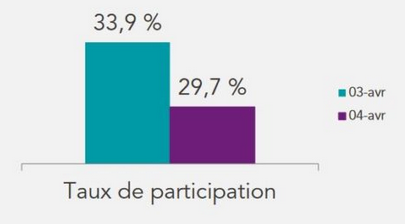
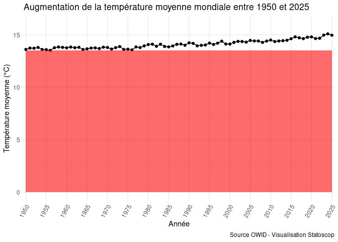
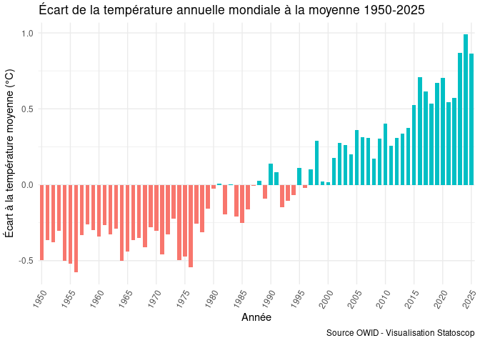

Title: Faire apparaître le zéro sur l'axe des ordonnées dans vos visualisations : arguments et exemples
Author: Antoine
Date: '2026-01-23'
Category: R, DataViz
Tags: R, ggplot2, dataviz
Cover: images/cover_27.png
twitter_image: images/cover_27.png
Summary: Comment choisir les représentations les plus pertinentes pour ne pas fausser l'interprétation de vos dataviz.

[TOC]

Dans cette note on s'intéresse à un débat classique dans le milieu de la dataviz et de l'analyse des données en général : l'obligation (ou non) de **faire apparaître le zéro sur l'axe des ordonnées**. Comme d'habitude, on essaye de vous expliquer intuitivement les causes de ce débat âpre (si si!) et de vous proposer une approche pour **ne pas tromper involontairement** les lecteurs de vos prochaines visualisations de données.

# Interprétations fallacieuses de visualisations sans le zéro sur l'axe des ordonnées

Le choix de l'intervalle des valeurs présentées sur l'axe des ordonnées dans une visualisation se porte souvent sur les valeurs minimum et maximum des données à disposition. Pourquoi le fait de **ne pas mettre le zéro sur l'axe des ordonnées est trompeur**? Nous allons essayer de répondre en distinguant les graphiques en barres et les courbes.

## Mauvais rendu des quantités réelles pour les graphiques en barres

C'est le cas le plus clair : **l'absence de zéro dans un graphique en barres fausse complètement l'interprétation de ceux-ci**. Un exemple très parlant recensé par [le site Quoi Dans Mon Assiette](https://quoidansmonassiette.fr/tromper-avec-graphiques-representations-visuelles-pour-manipuler-opinion-publique-guide/) est celui de la visualisation du taux de gréviste fourni par la SNCF durant une mobilisation en avril 2018 :

Cette visualition vise assez évidemment à **insister sur la baisse de la participation aux grèves**. Visuellement, il semble que **celle-ci a chuté de moitié au moins**. En effet, notre cerveau compare logiquement les volumes des deux barres et constate que **l'une est environ deux fois plus petite que l'autre**. Or, si la baisse est réelle, elle est seulement de 4 points de pourcentage soit une baisse d'à peine plus de 10%, loin du rendu visuel proposé par la communication de la SNCF. Cette **manipulation de l'ampleur du phénomène** est entièrement dûe à l'absence du zéro sur l'axe des ordonnées. Voici comment rend la visualisation correctement reproduite par les auteurs de l'article :

**L'effet est moins spectaculaire** mais le rendu est bien plus fidèle aux faits. Dans le cas des graphiques en colonnes, il y a donc **un certain consensus** sur le fait que le zéro sur l'axe des ordonnées n'est "pas négociable", du fait que le lecteur compare forcément les volumes et que **ceux-ci n'ont pas de sens si les colonnes ne partent pas de zéro**. Mais qu'en est-il des courbes?

> 👋 Nous c'est Antoine et Louis de Statoscop, une coopérative de statisticiens / data scientists.
> Vous voulez en savoir plus sur ce que l'on fait?

   <a href="https://statoscop.fr" target=_blank class="btn btn-primary btn-custom text-uppercase" type="button">Visiter notre site</a>
   <a href="https://statoscop.fr/contact" target=_blank class="btn btn-primary btn-custom text-uppercase" type="button">Nous contacter</a>

     

## Évolutions trompeuses avec les courbes

Dans le cas des courbes, [le sujet fait plus débat](https://stats.stackexchange.com/questions/184525/how-to-determine-whether-or-not-the-y-axis-of-a-graph-should-start-at-zero). D'ailleurs, **`ggplot2` ne met pas le zéro par défaut sur l'axe des ordonnées pour les graphiques avec `geom_line` alors qu'il le fait avec `geom_col` ou `geom_bar.`**

Pourtant, le fait de ne pas inclure le zéro dans ce type de graphiques nous semble aussi poser problème. Prenons l'exemple du réchauffement climatique, qui se traduit notamment par une augmentation des températures à la surface mondiales. On récupère ici ces données sur le site [Our World In Data](https://ourworldindata.org/). Voilà ce que donne une représentation classique de ces données si nous sélectionnons de manière malveillante les années 2016 à 2022 :  

<!-- -->

On voit ici qu'en plus d'avoir sélectionné les années qui nous convenaient pour faire passer un message trompeur, c'est bien __l'échelle des ordonnées de type min/max qui rend les variations des températures artificiellement élevées__ entre 2016 et 2022. En effet, les données dans leur ensemble racontent un tout autre message :  

<!-- -->

# Alternatives quand il semble compliqué de faire apparaître le zéro sur l'axe des ordonnées    

Le dernier graphique montrant les températures moyennes entre 1950 et 2025 semble plus acceptable que le précédent, même s'il se contente de prendre une échelle min/max pour l'axe des ordonnées. Et s'il est en effet bien moins incorrect, c'est __parce qu'il contient presque l'ensemble des valeurs de température moyenne connues par l'être humain__ (qui n'ont pas beaucoup varié avant 1950). 

## Problème quand le zéro n'est pas une valeur _possible_ des données  

On pourrait en effet arguer que se "forcer" à inclure le zéro sur l'axe des ordonnées, alors même qu'une température moyenne mondiale à zéro degré n'aurait aucun sens sur la planète telle qu'on la connaît, fausserait le résultat. Tout d'abord __cela aurait tendance à minimiser le constat__ du réchauffement climatique actuel, et cela donnerait en plus un __graphique avec un grand espace inutilisé__ (et inutilisable, puisque ne contenant pas des valeurs plausibles de nos données) :  

<!-- -->

## Visualisations alternatives  

Alors, que faire? Dans ce cas, __inclure le zéro dans l'axe des ordonnées ne semble pas pertinent__. Mais cette règle a l'avantage d'avoir une certaine objectivité et de ne pas permettre à chacun de faire en fonction de ce qui l'arrange. Si l'on souhaite continuer à s'y tenir, on peut imaginer des solutions alternatives. Souvent, il s'agira de __visualiser des variations plutôt que des niveaux__. Cette solution permet à la fois d'avoir __une échelle des ordonnées incluant le zéro__ et donc moins trompeuse, et de mettre en évidence les tendances. Dans notre cas, on peut par exemple calculer la différence entre la température moyenne d'une année par rapport à la température moyenne sur tout une période. On choisit alors de __représenter les données sous forme de barres__ car cela nous semble mieux illustrer que nous présentons pour chaque année des écarts à une valeur fixe :  

<!-- -->

# Pour vos prochaines dataviz  

Que l'on vous ait convaincu ou pas d'essayer d'inclure le zéro dans vos dataviz, on espère au moins que vous aurez désormais l'œil pour repérer ces visualisations qui - volontairement ou non - trompent le lecteur sur l'ampleur d'un phénomène. Il va de toute façon de soi __qu'aucune règle immuable ne pourra jamais nous permettre de nous passer d'un regard critique et constructif__ sur les résultats qui nous sont soumis et que l'on soumet. 

C'est tout pour aujourd'hui! Si vous avez besoin de conseils en programmation pour [la statistique et la data science](https://statoscop.fr), n'hésitez pas à nous contacter sur notre site, ou sur nos réseaux [BlueSky](https://bsky.app/profile/statoscop.fr) ou [Linkedin](https://www.linkedin.com/company/statoscop).

   <a href="https://statoscop.fr" target=_blank class="btn btn-primary btn-custom text-uppercase" type="button">Visiter notre site</a>
   <a href="https://statoscop.fr/contact" target=_blank class="btn btn-primary btn-custom text-uppercase" type="button">Nous contacter</a>

   

